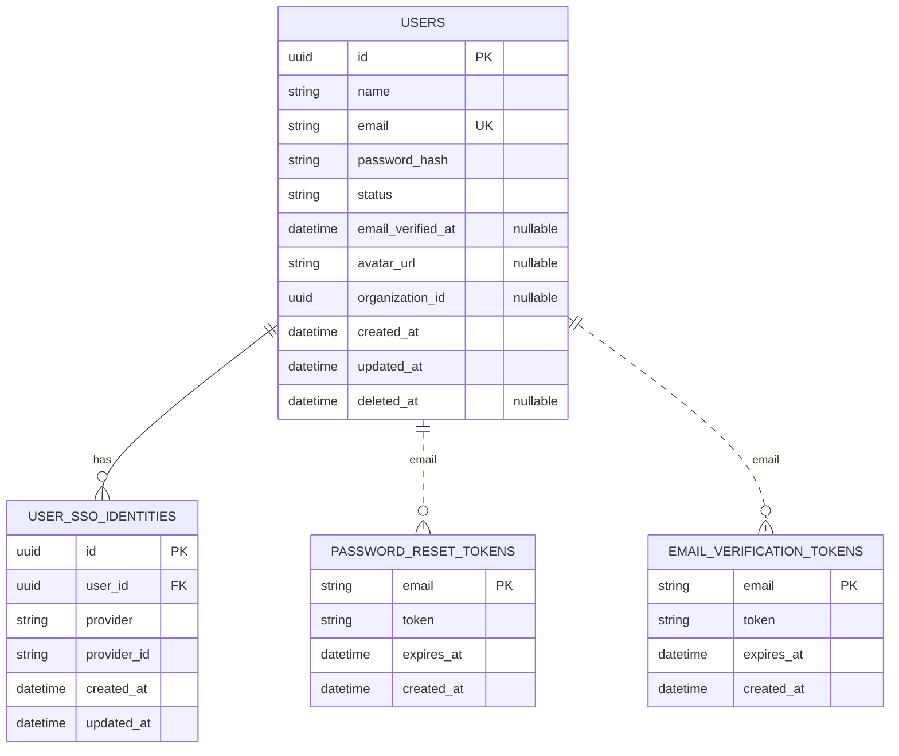
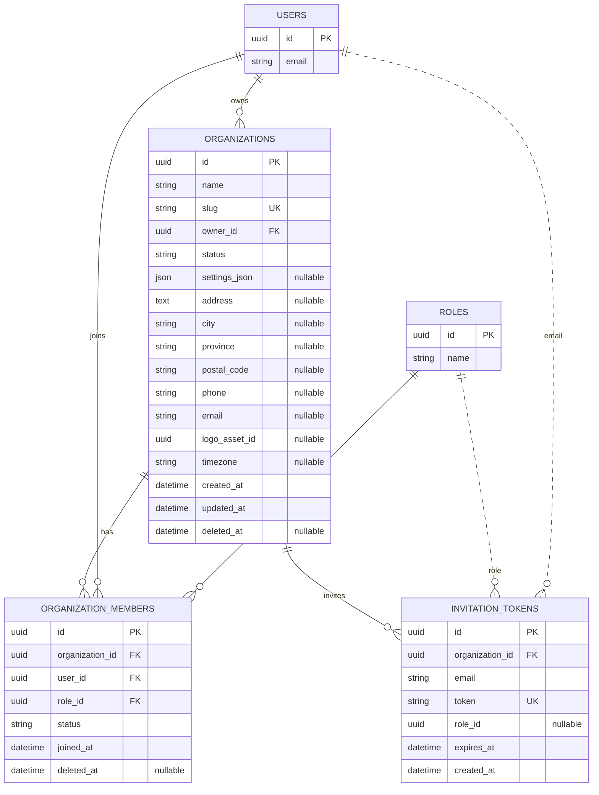
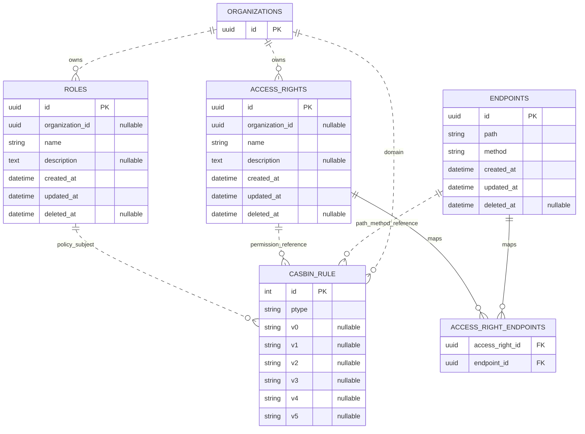
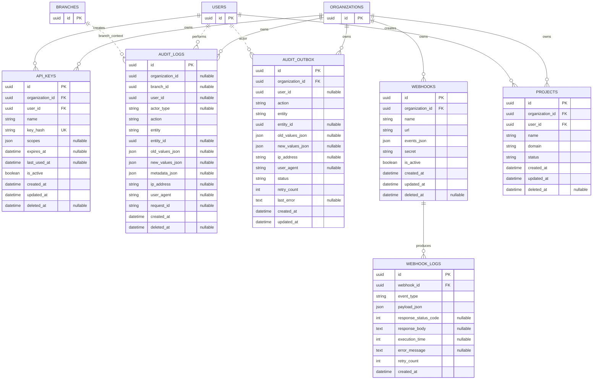
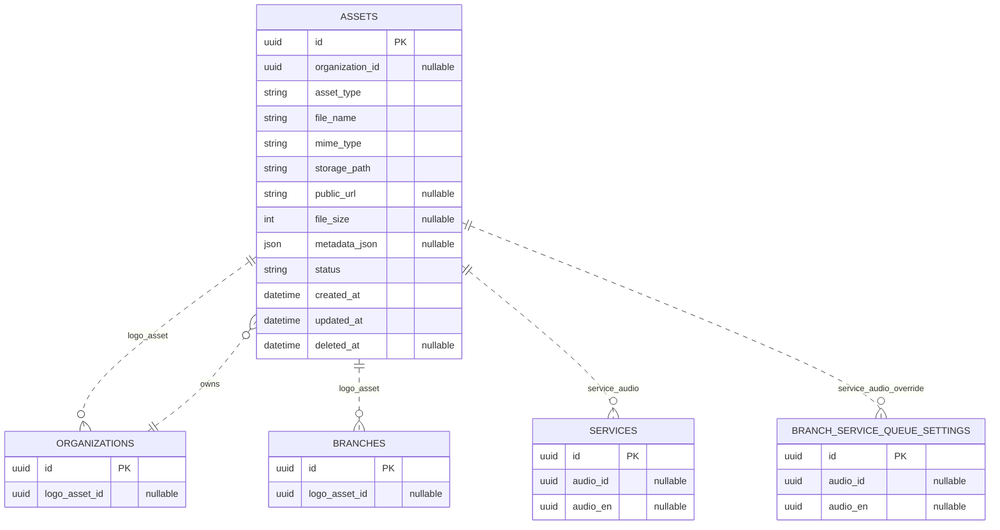
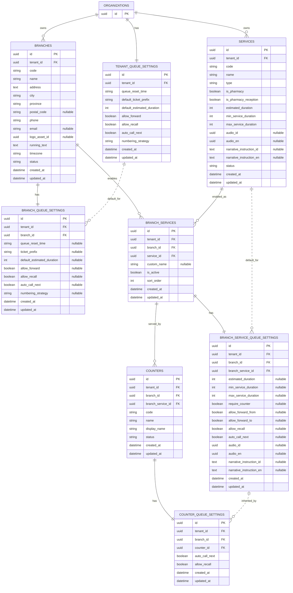
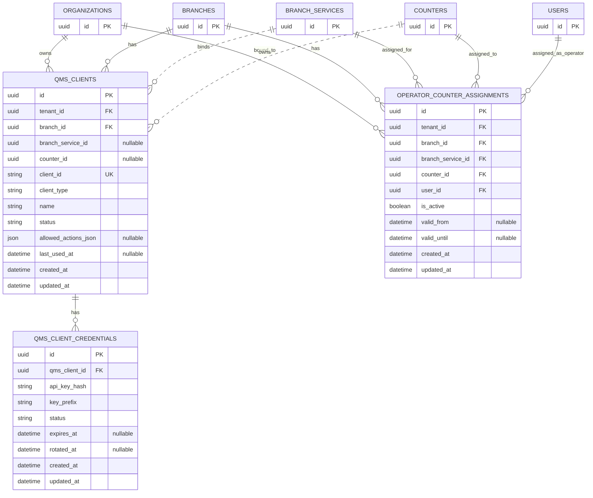
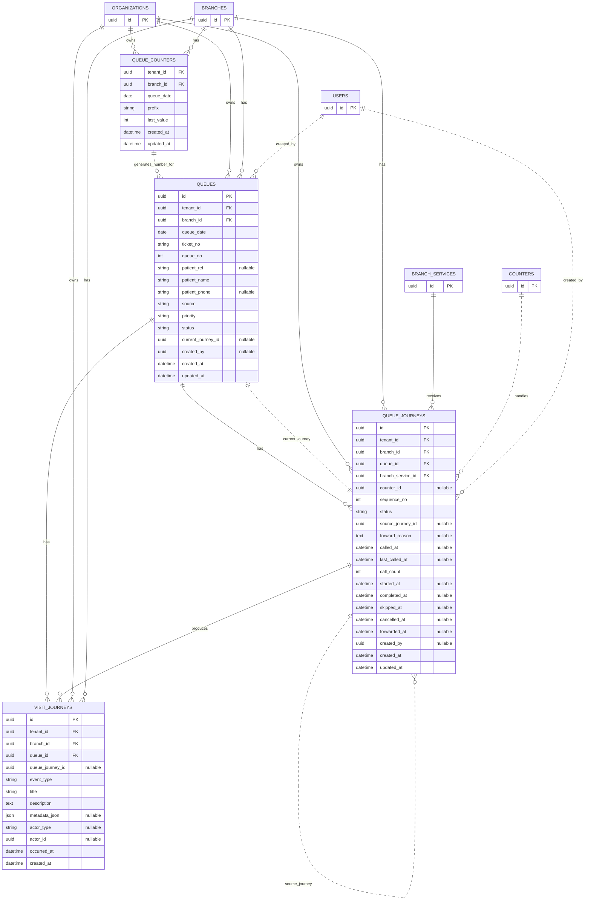

# Dokumentasi Desain Database Aplikasi QMS Rebuild

## Detail Field, ERD, dan Relasi Terdekat per Table

---

# 1. Tujuan

Dokumen ini menjelaskan desain database aplikasi QMS rebuild dengan fokus pada:

```text
1. Daftar table aplikasi
2. Field utama setiap table
3. ERD detail yang memuat field table
4. Relasi terdekat antar table
```

Dokumen ini tidak membahas:

```text
API flow
request lifecycle
migration step-by-step
business process detail
implementation code
```

---

# 2. Prinsip Database

## 2.1 Organization adalah Tenant

Root multi-tenant aplikasi adalah:

```text
organizations
```

Dalam domain QMS, istilahnya adalah:

```text
tenant
```

Maka:

```text
organization = tenant
```

Table QMS menggunakan:

```text
tenant_id
```

yang mengarah ke:

```text
organizations.id
```

---

## 2.2 User adalah Global Identity

`users` adalah identity global.

User masuk ke organization melalui:

```text
organization_members
```

Operator caller diikat ke counter melalui:

```text
operator_counter_assignments
```

---

## 2.3 QMS Data Wajib Tenant-Aware

Semua table QMS wajib memiliki:

```text
tenant_id
```

Data yang berada di bawah branch wajib memiliki:

```text
tenant_id
branch_id
```

---

# 3. Full Table List

## 3.1 Identity & Auth

```text
users
password_reset_tokens
email_verification_tokens
user_sso_identities
```

## 3.2 Organization / Tenant

```text
organizations
organization_members
invitation_tokens
```

## 3.3 Authorization

```text
roles
access_rights
endpoints
access_right_endpoints
casbin_rule
```

## 3.4 API Key, Audit, Webhook, Starter

```text
api_keys
audit_logs
audit_outbox
webhooks
webhook_logs
projects
```

## 3.5 Asset Support

```text
assets
```

## 3.6 QMS Setup

```text
branches
tenant_queue_settings
branch_queue_settings

services
branch_services
branch_service_queue_settings

counters
counter_queue_settings
```

## 3.7 QMS Client Binding

```text
qms_clients
qms_client_credentials
operator_counter_assignments
```

## 3.8 QMS Operation

```text
queue_counters
queues
queue_journeys
visit_journeys
```

---

# 4. Global ERD Overview

```mermaid
erDiagram
    USERS ||--o{ ORGANIZATION_MEMBERS : joins
    ORGANIZATIONS ||--o{ ORGANIZATION_MEMBERS : has
    ROLES ||--o{ ORGANIZATION_MEMBERS : assigned_as

    USERS ||--o{ USER_SSO_IDENTITIES : has
    USERS ||--o{ API_KEYS : creates
    USERS ||--o{ AUDIT_LOGS : performs
    USERS ||--o{ OPERATOR_COUNTER_ASSIGNMENTS : assigned_as_operator

    ORGANIZATIONS ||--o{ ROLES : owns
    ORGANIZATIONS ||--o{ ACCESS_RIGHTS : owns
    ORGANIZATIONS ||--o{ API_KEYS : owns
    ORGANIZATIONS ||--o{ AUDIT_LOGS : owns
    ORGANIZATIONS ||--o{ AUDIT_OUTBOX : owns
    ORGANIZATIONS ||--o{ WEBHOOKS : owns
    ORGANIZATIONS ||--o{ PROJECTS : owns
    ORGANIZATIONS ||--o{ BRANCHES : owns
    ORGANIZATIONS ||--|| TENANT_QUEUE_SETTINGS : has
    ORGANIZATIONS ||--o{ SERVICES : owns
    ORGANIZATIONS ||--o{ QUEUES : owns
    ORGANIZATIONS ||--o{ QUEUE_COUNTERS : owns
    ORGANIZATIONS ||--o{ QMS_CLIENTS : owns

    ACCESS_RIGHTS ||--o{ ACCESS_RIGHT_ENDPOINTS : maps
    ENDPOINTS ||--o{ ACCESS_RIGHT_ENDPOINTS : maps

    WEBHOOKS ||--o{ WEBHOOK_LOGS : produces

    ASSETS ||--o{ ORGANIZATIONS : used_as_logo
    ASSETS ||--o{ BRANCHES : used_as_logo
    ASSETS ||--o{ SERVICES : used_as_audio
    ASSETS ||--o{ BRANCH_SERVICE_QUEUE_SETTINGS : used_as_audio_override

    BRANCHES ||--|| BRANCH_QUEUE_SETTINGS : has
    BRANCHES ||--o{ BRANCH_SERVICES : enables
    BRANCHES ||--o{ COUNTERS : has
    BRANCHES ||--o{ QUEUES : has
    BRANCHES ||--o{ QUEUE_JOURNEYS : has
    BRANCHES ||--o{ VISIT_JOURNEYS : has
    BRANCHES ||--o{ QUEUE_COUNTERS : has
    BRANCHES ||--o{ QMS_CLIENTS : has
    BRANCHES ||--o{ OPERATOR_COUNTER_ASSIGNMENTS : has

    SERVICES ||--o{ BRANCH_SERVICES : enabled_as

    BRANCH_SERVICES ||--|| BRANCH_SERVICE_QUEUE_SETTINGS : has
    BRANCH_SERVICES ||--o{ COUNTERS : served_by
    BRANCH_SERVICES ||--o{ QUEUE_JOURNEYS : receives
    BRANCH_SERVICES ||--o{ QMS_CLIENTS : binds
    BRANCH_SERVICES ||--o{ OPERATOR_COUNTER_ASSIGNMENTS : assigned_for

    COUNTERS ||--|| COUNTER_QUEUE_SETTINGS : has
    COUNTERS ||--o{ QUEUE_JOURNEYS : handles
    COUNTERS ||--o{ QMS_CLIENTS : bound_to
    COUNTERS ||--o{ OPERATOR_COUNTER_ASSIGNMENTS : assigned_to

    QMS_CLIENTS ||--o{ QMS_CLIENT_CREDENTIALS : has

    QUEUES ||--o{ QUEUE_JOURNEYS : has
    QUEUES ||--o{ VISIT_JOURNEYS : has
    QUEUE_JOURNEYS ||--o{ VISIT_JOURNEYS : produces
```



---

# 5. Identity & Auth ERD Detail



## Relasi terdekat

### `users`

```text
users has many organization_members
users has many user_sso_identities
users has many api_keys
users has many audit_logs
users has many operator_counter_assignments
users is referenced logically by password_reset_tokens.email
users is referenced logically by email_verification_tokens.email
```

### `password_reset_tokens`

```text
password_reset_tokens references users by email logically
```

### `email_verification_tokens`

```text
email_verification_tokens references users by email logically
```

### `user_sso_identities`

```text
user_sso_identities belongs to users
```

---

# 6. Organization / Tenant ERD Detail



## Relasi terdekat

### `organizations`

```text
organizations has many organization_members
organizations has many users through organization_members
organizations has many roles
organizations has many access_rights
organizations has many api_keys
organizations has many audit_logs
organizations has many audit_outbox
organizations has many webhooks
organizations has many projects
organizations has many branches
organizations has one tenant_queue_settings
organizations has many services
organizations has many queues
organizations has many queue_counters
organizations has many qms_clients
organizations optionally uses assets as logo_asset_id
```

### `organization_members`

```text
organization_members belongs to organizations
organization_members belongs to users
organization_members belongs to roles
```

### `invitation_tokens`

```text
invitation_tokens belongs to organizations
invitation_tokens references roles logically by role_id
invitation_tokens references invited user logically by email
```

---

# 7. Authorization ERD Detail



## Relasi terdekat

### `roles`

```text
roles optionally belongs to organizations
roles has many organization_members
roles participates in casbin_rule policies
```

### `access_rights`

```text
access_rights optionally belongs to organizations
access_rights has many access_right_endpoints
access_rights can be represented in casbin_rule logically
```

### `endpoints`

```text
endpoints has many access_right_endpoints
endpoints can be represented in casbin_rule by path and method
```

### `access_right_endpoints`

```text
access_right_endpoints belongs to access_rights
access_right_endpoints belongs to endpoints
```

### `casbin_rule`

```text
casbin_rule references users logically
casbin_rule references roles logically
casbin_rule references organization/domain logically
casbin_rule references path/method logically
```

---

# 8. API Key, Audit, Webhook, Project ERD Detail



## Relasi terdekat

### `api_keys`

```text
api_keys belongs to organizations
api_keys belongs to users
```

### `audit_logs`

```text
audit_logs belongs to organizations
audit_logs optionally belongs to users
audit_logs optionally belongs to branches
audit_logs references target resource by entity + entity_id
```

### `audit_outbox`

```text
audit_outbox belongs to organizations
audit_outbox optionally belongs to users
audit_outbox relates to audit_logs logically
```

### `webhooks`

```text
webhooks belongs to organizations
webhooks has many webhook_logs
```

### `webhook_logs`

```text
webhook_logs belongs to webhooks
```

### `projects`

```text
projects belongs to organizations
projects belongs to users
```

---

# 9. Asset ERD Detail



## Relasi terdekat

### `assets`

```text
assets optionally belongs to organizations
assets can be referenced by organizations.logo_asset_id
assets can be referenced by branches.logo_asset_id
assets can be referenced by services.audio_id
assets can be referenced by services.audio_en
assets can be referenced by branch_service_queue_settings.audio_id
assets can be referenced by branch_service_queue_settings.audio_en
```

---

# 10. QMS Setup ERD Detail



## Relasi terdekat

### `branches`

```text
branches belongs to organizations via tenant_id
branches has one branch_queue_settings
branches has many branch_services
branches has many counters
branches has many queues
branches has many queue_journeys
branches has many visit_journeys
branches has many queue_counters
branches has many qms_clients
branches has many operator_counter_assignments
branches has many audit_logs
```

### `tenant_queue_settings`

```text
tenant_queue_settings belongs to organizations via tenant_id
tenant_queue_settings provides default values for branch_queue_settings
tenant_queue_settings affects queue_counters and queues
```

### `branch_queue_settings`

```text
branch_queue_settings belongs to organizations via tenant_id
branch_queue_settings belongs to branches
branch_queue_settings overrides tenant_queue_settings
branch_queue_settings affects queue_date, ticket_no, and queue number generation
```

### `services`

```text
services belongs to organizations via tenant_id
services has many branch_services
services provides default duration for branch_service_queue_settings
services provides default audio and narrative for signage/caller
```

### `branch_services`

```text
branch_services belongs to organizations via tenant_id
branch_services belongs to branches
branch_services belongs to services
branch_services has one branch_service_queue_settings
branch_services has many counters
branch_services has many queue_journeys
branch_services has many qms_clients
branch_services has many operator_counter_assignments
```

### `branch_service_queue_settings`

```text
branch_service_queue_settings belongs to organizations via tenant_id
branch_service_queue_settings belongs to branches
branch_service_queue_settings belongs to branch_services
branch_service_queue_settings overrides services
branch_service_queue_settings affects queue estimate, audio, narrative, recall, and auto-call behavior
```

### `counters`

```text
counters belongs to organizations via tenant_id
counters belongs to branches
counters belongs to branch_services
counters has one counter_queue_settings
counters has many queue_journeys
counters has many qms_clients
counters has many operator_counter_assignments
```

### `counter_queue_settings`

```text
counter_queue_settings belongs to organizations via tenant_id
counter_queue_settings belongs to branches
counter_queue_settings belongs to counters
counter_queue_settings overrides branch_service_queue_settings
```

---

# 11. QMS Client Binding ERD Detail



## Relasi terdekat

### `qms_clients`

```text
qms_clients belongs to organizations via tenant_id
qms_clients belongs to branches
qms_clients optionally belongs to branch_services
qms_clients optionally belongs to counters
qms_clients has many qms_client_credentials
```

### `qms_client_credentials`

```text
qms_client_credentials belongs to qms_clients
```

### `operator_counter_assignments`

```text
operator_counter_assignments belongs to organizations via tenant_id
operator_counter_assignments belongs to branches
operator_counter_assignments belongs to branch_services
operator_counter_assignments belongs to counters
operator_counter_assignments belongs to users
```

---

# 12. QMS Operation ERD Detail



## Relasi terdekat

### `queue_counters`

```text
queue_counters belongs to organizations via tenant_id
queue_counters belongs to branches
queue_counters supports queues creation
queue_counters generates queue_no and ticket_no sequence
```

### `queues`

```text
queues belongs to organizations via tenant_id
queues belongs to branches
queues has many queue_journeys
queues has many visit_journeys
queues current_journey_id references queue_journeys
queues uses queue_counters for number generation
queues optionally references users via created_by
```

### `queue_journeys`

```text
queue_journeys belongs to organizations via tenant_id
queue_journeys belongs to branches
queue_journeys belongs to queues
queue_journeys belongs to branch_services
queue_journeys optionally belongs to counters
queue_journeys optionally references previous queue_journeys through source_journey_id
queue_journeys optionally references users via created_by
queue_journeys has many visit_journeys
```

### `visit_journeys`

```text
visit_journeys belongs to organizations via tenant_id
visit_journeys belongs to branches
visit_journeys belongs to queues
visit_journeys optionally belongs to queue_journeys
visit_journeys optionally references actor by actor_type + actor_id
```

---

# 13. Per-Table Compact Relationship Summary

## Identity & Auth

```text
users
  -> organization_members
  -> user_sso_identities
  -> api_keys
  -> audit_logs
  -> operator_counter_assignments

password_reset_tokens
  -> users by email logically

email_verification_tokens
  -> users by email logically

user_sso_identities
  -> users
```

## Organization / Tenant

```text
organizations
  -> organization_members
  -> roles
  -> access_rights
  -> api_keys
  -> audit_logs
  -> audit_outbox
  -> webhooks
  -> projects
  -> branches
  -> tenant_queue_settings
  -> services
  -> queues
  -> queue_counters
  -> qms_clients

organization_members
  -> organizations
  -> users
  -> roles

invitation_tokens
  -> organizations
  -> roles logically
  -> users by email logically
```

## Authorization

```text
roles
  -> organizations optionally
  -> organization_members
  -> casbin_rule logically

access_rights
  -> organizations optionally
  -> access_right_endpoints

endpoints
  -> access_right_endpoints

access_right_endpoints
  -> access_rights
  -> endpoints

casbin_rule
  -> users logically
  -> roles logically
  -> organizations/domain logically
  -> endpoints logically
```

## API, Audit, Webhook

```text
api_keys
  -> organizations
  -> users

audit_logs
  -> organizations
  -> users optionally
  -> branches optionally
  -> any resource by entity + entity_id

audit_outbox
  -> organizations
  -> users optionally
  -> audit_logs logically

webhooks
  -> organizations
  -> webhook_logs

webhook_logs
  -> webhooks

projects
  -> organizations
  -> users
```

## Assets

```text
assets
  -> organizations optionally
  <- organizations.logo_asset_id
  <- branches.logo_asset_id
  <- services.audio_id
  <- services.audio_en
  <- branch_service_queue_settings.audio_id
  <- branch_service_queue_settings.audio_en
```

## QMS Setup

```text
branches
  -> organizations
  -> branch_queue_settings
  -> branch_services
  -> counters
  -> queues
  -> queue_journeys
  -> visit_journeys
  -> queue_counters
  -> qms_clients
  -> operator_counter_assignments

tenant_queue_settings
  -> organizations
  -> branch_queue_settings
  -> queues logically
  -> queue_counters logically

branch_queue_settings
  -> organizations
  -> branches
  -> tenant_queue_settings logically

services
  -> organizations
  -> branch_services
  -> branch_service_queue_settings logically

branch_services
  -> organizations
  -> branches
  -> services
  -> branch_service_queue_settings
  -> counters
  -> queue_journeys
  -> qms_clients
  -> operator_counter_assignments

branch_service_queue_settings
  -> organizations
  -> branches
  -> branch_services
  -> services logically
  -> counter_queue_settings logically

counters
  -> organizations
  -> branches
  -> branch_services
  -> counter_queue_settings
  -> queue_journeys
  -> qms_clients
  -> operator_counter_assignments

counter_queue_settings
  -> organizations
  -> branches
  -> counters
```

## QMS Client Binding

```text
qms_clients
  -> organizations
  -> branches
  -> branch_services optionally
  -> counters optionally
  -> qms_client_credentials

qms_client_credentials
  -> qms_clients

operator_counter_assignments
  -> organizations
  -> branches
  -> branch_services
  -> counters
  -> users
```

## QMS Operation

```text
queue_counters
  -> organizations
  -> branches
  -> queues logically

queues
  -> organizations
  -> branches
  -> queue_journeys
  -> visit_journeys
  -> queue_counters logically
  -> users optionally through created_by

queue_journeys
  -> organizations
  -> branches
  -> queues
  -> branch_services
  -> counters optionally
  -> queue_journeys optionally through source_journey_id
  -> visit_journeys
  -> users optionally through created_by

visit_journeys
  -> organizations
  -> branches
  -> queues
  -> queue_journeys optionally
  -> actor logically through actor_type + actor_id
```

---

# 14. Final Summary

Database aplikasi QMS rebuild memiliki dua layer besar:

```text
Platform Layer
- users
- organizations
- roles
- access rights
- endpoint mapping
- Casbin policy
- API keys
- audit logs
- webhooks
- projects
- assets

QMS Layer
- branches
- services
- branch services
- counters
- typed queue settings
- qms clients
- caller/signage credentials
- operator assignments
- queues
- queue journeys
- visit journeys
- queue counters
```

Relasi QMS utama:

```text
organization
  -> branch
  -> branch_service
  -> counter
```

Relasi operational queue utama:

```text
queue
  -> queue_journey
  -> visit_journey
```

Relasi caller/signage utama:

```text
qms_client
  -> qms_client_credentials
  -> branch / branch_service / counter context
```

Relasi operator caller utama:

```text
user
  -> operator_counter_assignment
  -> counter
```

Dengan desain ini, setiap table memiliki fungsi domain yang jelas, field yang eksplisit, dan relasi terdekat yang mudah dipahami.
