# QMS NEW Design Diagrams

## 1. High-Level System Context

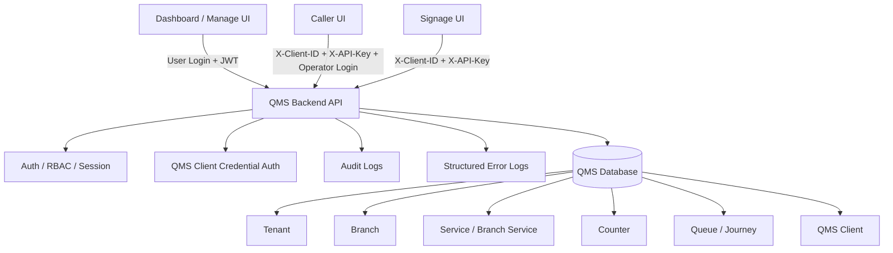
```mermaid
flowchart TB
    Admin[Dashboard / Manage UI]
    Caller[Caller UI]
    Signage[Signage UI]

    API[QMS Backend API]

    Auth[Auth / RBAC / Session]
    ClientAuth[QMS Client Credential Auth]
    Audit[Audit Logs]
    Log[Structured Error Logs]

    DB[(QMS Database)]

    Admin -->|User Login + JWT| API
    Caller -->|X-Client-ID + X-API-Key + Operator Login| API
    Signage -->|X-Client-ID + X-API-Key| API

    API --> Auth
    API --> ClientAuth
    API --> Audit
    API --> Log
    API --> DB

    DB --> Tenant[Tenant]
    DB --> Branch[Branch]
    DB --> Service[Service / Branch Service]
    DB --> Counter[Counter]
    DB --> Queue[Queue / Journey]
    DB --> Client[QMS Client]
```

---

## 2. NEW ERD

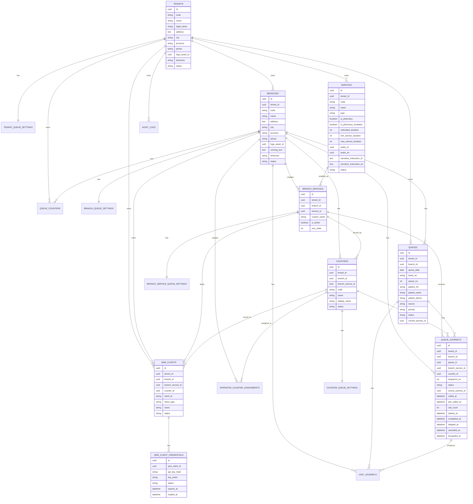
```mermaid
erDiagram
    TENANTS ||--|| TENANT_QUEUE_SETTINGS : has
    TENANTS ||--o{ BRANCHES : owns
    TENANTS ||--o{ SERVICES : owns
    TENANTS ||--o{ QMS_CLIENTS : owns
    TENANTS ||--o{ QUEUES : owns
    TENANTS ||--o{ QUEUE_COUNTERS : owns
    TENANTS ||--o{ AUDIT_LOGS : owns

    BRANCHES ||--|| BRANCH_QUEUE_SETTINGS : has
    BRANCHES ||--o{ BRANCH_SERVICES : enables
    BRANCHES ||--o{ COUNTERS : has
    BRANCHES ||--o{ QMS_CLIENTS : owns
    BRANCHES ||--o{ OPERATOR_COUNTER_ASSIGNMENTS : assigns
    BRANCHES ||--o{ QUEUES : has
    BRANCHES ||--o{ QUEUE_JOURNEYS : has
    BRANCHES ||--o{ VISIT_JOURNEYS : has
    BRANCHES ||--o{ QUEUE_COUNTERS : has

    SERVICES ||--o{ BRANCH_SERVICES : enabled_as

    BRANCH_SERVICES ||--|| BRANCH_SERVICE_QUEUE_SETTINGS : has
    BRANCH_SERVICES ||--o{ COUNTERS : served_by
    BRANCH_SERVICES ||--o{ QUEUE_JOURNEYS : receives
    BRANCH_SERVICES ||--o{ QMS_CLIENTS : binds

    COUNTERS ||--|| COUNTER_QUEUE_SETTINGS : has
    COUNTERS ||--o{ OPERATOR_COUNTER_ASSIGNMENTS : assigned_to
    COUNTERS ||--o{ QMS_CLIENTS : bound_to
    COUNTERS ||--o{ QUEUE_JOURNEYS : handles

    QMS_CLIENTS ||--o{ QMS_CLIENT_CREDENTIALS : has

    QUEUES ||--o{ QUEUE_JOURNEYS : has
    QUEUES ||--o{ VISIT_JOURNEYS : has

    QUEUE_JOURNEYS ||--o{ VISIT_JOURNEYS : produces

    TENANTS {
        uuid id
        string code
        string name
        string legal_name
        text address
        string city
        string province
        string phone
        uuid logo_asset_id
        string timezone
        string status
    }

    BRANCHES {
        uuid id
        uuid tenant_id
        string code
        string name
        text address
        string city
        string province
        string phone
        uuid logo_asset_id
        text running_text
        string timezone
        string status
    }

    SERVICES {
        uuid id
        uuid tenant_id
        string code
        string name
        string type
        boolean is_pharmacy
        boolean is_pharmacy_reception
        int estimated_duration
        int min_service_duration
        int max_service_duration
        uuid audio_id
        uuid audio_en
        text narrative_instruction_id
        text narrative_instruction_en
        string status
    }

    BRANCH_SERVICES {
        uuid id
        uuid tenant_id
        uuid branch_id
        uuid service_id
        string custom_name
        boolean is_active
        int sort_order
    }

    COUNTERS {
        uuid id
        uuid tenant_id
        uuid branch_id
        uuid branch_service_id
        string code
        string name
        string display_name
        string status
    }

    QUEUES {
        uuid id
        uuid tenant_id
        uuid branch_id
        date queue_date
        string ticket_no
        int queue_no
        string patient_ref
        string patient_name
        string patient_phone
        string source
        string priority
        string status
        uuid current_journey_id
    }

    QUEUE_JOURNEYS {
        uuid id
        uuid tenant_id
        uuid branch_id
        uuid queue_id
        uuid branch_service_id
        uuid counter_id
        int sequence_no
        string status
        uuid source_journey_id
        datetime called_at
        datetime last_called_at
        int call_count
        datetime started_at
        datetime completed_at
        datetime skipped_at
        datetime cancelled_at
        datetime forwarded_at
    }

    QMS_CLIENTS {
        uuid id
        uuid tenant_id
        uuid branch_id
        uuid branch_service_id
        uuid counter_id
        string client_id
        string client_type
        string name
        string status
    }

    QMS_CLIENT_CREDENTIALS {
        uuid id
        uuid qms_client_id
        string api_key_hash
        string key_prefix
        string status
        datetime expires_at
        datetime rotated_at
    }
```

---

## 3. Typed Configuration Hierarchy

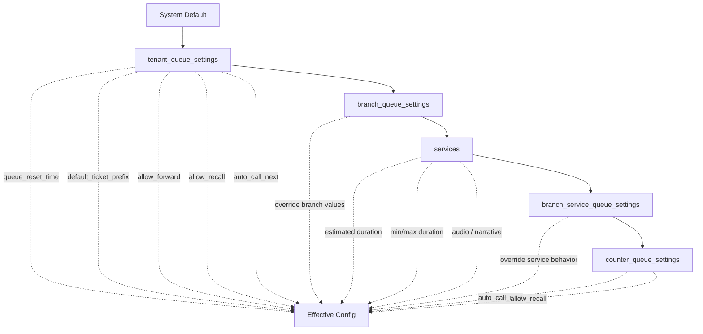
```mermaid
flowchart TB
    SystemDefault[System Default]
    TenantQS[tenant_queue_settings]
    BranchQS[branch_queue_settings]
    Service[services]
    BranchServiceQS[branch_service_queue_settings]
    CounterQS[counter_queue_settings]

    SystemDefault --> TenantQS
    TenantQS --> BranchQS
    BranchQS --> Service
    Service --> BranchServiceQS
    BranchServiceQS --> CounterQS

    TenantQS -.->|queue_reset_time| EffectiveConfig[Effective Config]
    TenantQS -.->|default_ticket_prefix| EffectiveConfig
    TenantQS -.->|allow_forward| EffectiveConfig
    TenantQS -.->|allow_recall| EffectiveConfig
    TenantQS -.->|auto_call_next| EffectiveConfig

    BranchQS -.->|override branch values| EffectiveConfig

    Service -.->|estimated duration| EffectiveConfig
    Service -.->|min/max duration| EffectiveConfig
    Service -.->|audio / narrative| EffectiveConfig

    BranchServiceQS -.->|override service behavior| EffectiveConfig

    CounterQS -.->|auto_call_next| EffectiveConfig
    CounterQS -.->|allow_recall| EffectiveConfig
```

---

## 4. MVP Operational Flow

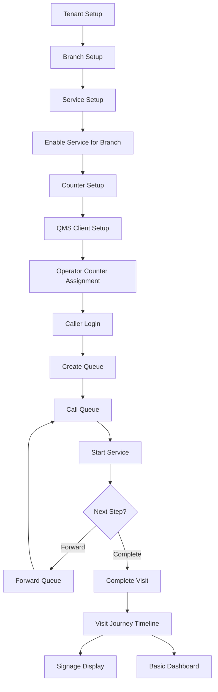
```mermaid
flowchart TD
    A[Tenant Setup]
    B[Branch Setup]
    C[Service Setup]
    D[Enable Service for Branch]
    E[Counter Setup]
    F[QMS Client Setup]
    G[Operator Counter Assignment]
    H[Caller Login]
    I[Create Queue]
    J[Call Queue]
    K[Start Service]
    L{Next Step?}
    M[Forward Queue]
    N[Complete Visit]
    O[Visit Journey Timeline]
    P[Signage Display]
    Q[Basic Dashboard]

    A --> B
    B --> C
    C --> D
    D --> E
    E --> F
    F --> G
    G --> H
    H --> I
    I --> J
    J --> K
    K --> L
    L -->|Forward| M
    M --> J
    L -->|Complete| N
    N --> O
    O --> P
    O --> Q
```

---

## 5. Setup Wizard Flow

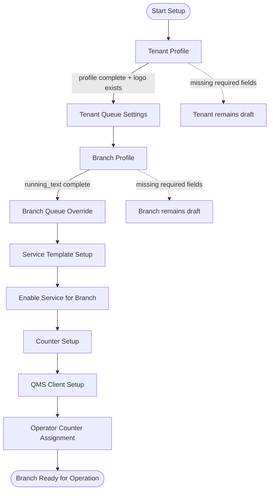
```mermaid
flowchart TD
    Start([Start Setup])
    TenantProfile[Tenant Profile]
    TenantQueue[Tenant Queue Settings]
    BranchProfile[Branch Profile]
    BranchQueue[Branch Queue Override]
    ServiceSetup[Service Template Setup]
    BranchService[Enable Service for Branch]
    CounterSetup[Counter Setup]
    ClientSetup[QMS Client Setup]
    OperatorAssign[Operator Counter Assignment]
    Ready([Branch Ready for Operation])

    Start --> TenantProfile
    TenantProfile -->|profile complete + logo exists| TenantQueue
    TenantQueue --> BranchProfile
    BranchProfile -->|running_text complete| BranchQueue
    BranchQueue --> ServiceSetup
    ServiceSetup --> BranchService
    BranchService --> CounterSetup
    CounterSetup --> ClientSetup
    ClientSetup --> OperatorAssign
    OperatorAssign --> Ready

    TenantProfile -.->|missing required fields| DraftTenant[Tenant remains draft]
    BranchProfile -.->|missing required fields| DraftBranch[Branch remains draft]
```

---

## 6. Dashboard / Caller / Signage Boundary

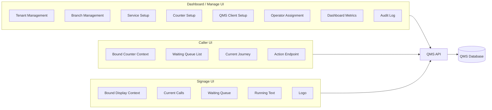
```mermaid
flowchart LR
    subgraph Dashboard["Dashboard / Manage UI"]
        D1[Tenant Management]
        D2[Branch Management]
        D3[Service Setup]
        D4[Counter Setup]
        D5[QMS Client Setup]
        D6[Operator Assignment]
        D7[Dashboard Metrics]
        D8[Audit Log]
    end

    subgraph Caller["Caller UI"]
        C1[Bound Counter Context]
        C2[Waiting Queue List]
        C3[Current Journey]
        C4[Action Endpoint]
    end

    subgraph Signage["Signage UI"]
        S1[Bound Display Context]
        S2[Current Calls]
        S3[Waiting Queue]
        S4[Running Text]
        S5[Logo]
    end

    Dashboard --> API[QMS API]
    Caller --> API
    Signage --> API

    API --> DB[(QMS Database)]
```

---

## 7. Caller Authentication Flow

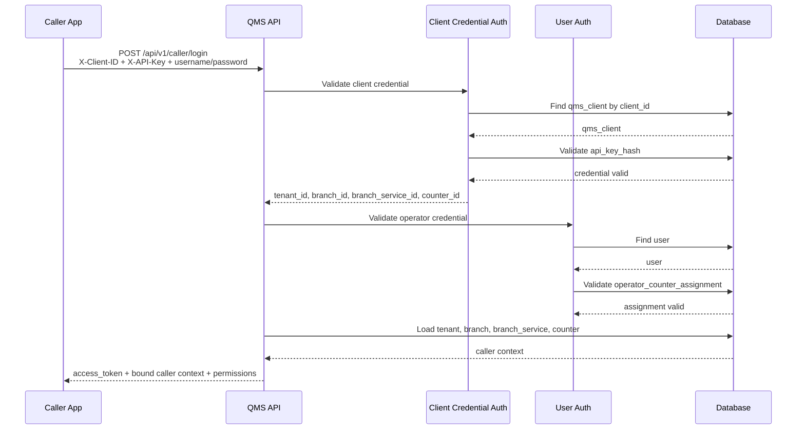
```mermaid
sequenceDiagram
    participant CallerApp as Caller App
    participant API as QMS API
    participant ClientAuth as Client Credential Auth
    participant UserAuth as User Auth
    participant DB as Database

    CallerApp->>API: POST /api/v1/caller/login<br/>X-Client-ID + X-API-Key + username/password
    API->>ClientAuth: Validate client credential
    ClientAuth->>DB: Find qms_client by client_id
    DB-->>ClientAuth: qms_client
    ClientAuth->>DB: Validate api_key_hash
    DB-->>ClientAuth: credential valid
    ClientAuth-->>API: tenant_id, branch_id, branch_service_id, counter_id

    API->>UserAuth: Validate operator credential
    UserAuth->>DB: Find user
    DB-->>UserAuth: user
    UserAuth->>DB: Validate operator_counter_assignment
    DB-->>UserAuth: assignment valid

    API->>DB: Load tenant, branch, branch_service, counter
    DB-->>API: caller context

    API-->>CallerApp: access_token + bound caller context + permissions
```

---

## 8. Signage Authentication Flow

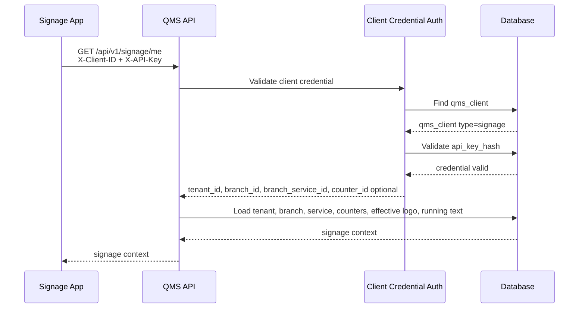
```mermaid
sequenceDiagram
    participant Signage as Signage App
    participant API as QMS API
    participant ClientAuth as Client Credential Auth
    participant DB as Database

    Signage->>API: GET /api/v1/signage/me<br/>X-Client-ID + X-API-Key
    API->>ClientAuth: Validate client credential
    ClientAuth->>DB: Find qms_client
    DB-->>ClientAuth: qms_client type=signage
    ClientAuth->>DB: Validate api_key_hash
    DB-->>ClientAuth: credential valid

    ClientAuth-->>API: tenant_id, branch_id, branch_service_id, counter_id optional
    API->>DB: Load tenant, branch, service, counters, effective logo, running text
    DB-->>API: signage context

    API-->>Signage: signage context
```

---

## 9. Create Queue Request Logic Flow

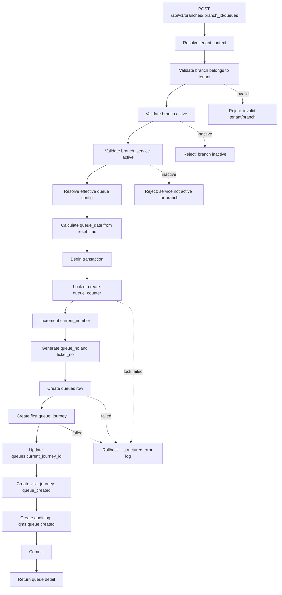
```mermaid
flowchart TD
    A[POST /api/v1/branches/:branch_id/queues]
    B[Resolve tenant context]
    C[Validate branch belongs to tenant]
    D[Validate branch active]
    E[Validate branch_service active]
    F[Resolve effective queue config]
    G[Calculate queue_date from reset time]
    H[Begin transaction]
    I[Lock or create queue_counter]
    J[Increment current_number]
    K[Generate queue_no and ticket_no]
    L[Create queues row]
    M[Create first queue_journey]
    N[Update queues.current_journey_id]
    O[Create visit_journey: queue_created]
    P[Create audit log: qms.queue.created]
    Q[Commit]
    R[Return queue detail]

    A --> B --> C --> D --> E --> F --> G --> H
    H --> I --> J --> K --> L --> M --> N --> O --> P --> Q --> R

    C -.invalid.-> ERR1[Reject: invalid tenant/branch]
    D -.inactive.-> ERR2[Reject: branch inactive]
    E -.inactive.-> ERR3[Reject: service not active for branch]
    I -.lock failed.-> ROLLBACK[Rollback + structured error log]
    L -.failed.-> ROLLBACK
    M -.failed.-> ROLLBACK
```

---

## 10. Caller Single Action Endpoint Flow

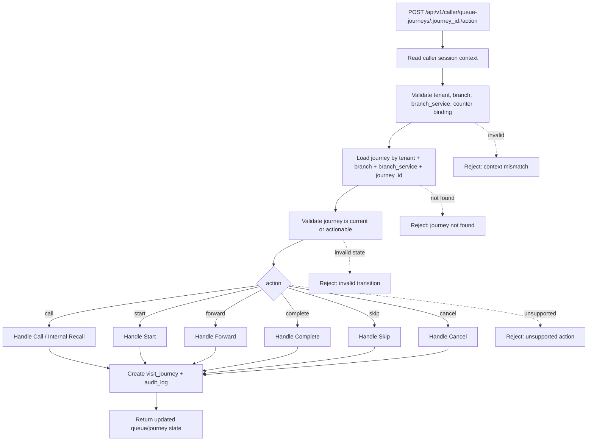
```mermaid
flowchart TD
    A[POST /api/v1/caller/queue-journeys/:journey_id:/action]
    B[Read caller session context]
    C[Validate tenant, branch, branch_service, counter binding]
    D[Load journey by tenant + branch + branch_service + journey_id]
    E[Validate journey is current or actionable]
    F{action}

    F -->|call| CALL[Handle Call / Internal Recall]
    F -->|start| START[Handle Start]
    F -->|forward| FORWARD[Handle Forward]
    F -->|complete| COMPLETE[Handle Complete]
    F -->|skip| SKIP[Handle Skip]
    F -->|cancel| CANCEL[Handle Cancel]

    A --> B --> C --> D --> E --> F

    CALL --> AUDIT[Create visit_journey + audit_log]
    START --> AUDIT
    FORWARD --> AUDIT
    COMPLETE --> AUDIT
    SKIP --> AUDIT
    CANCEL --> AUDIT

    AUDIT --> RESPONSE[Return updated queue/journey state]

    C -.invalid.-> ERR1[Reject: context mismatch]
    D -.not found.-> ERR2[Reject: journey not found]
    E -.invalid state.-> ERR3[Reject: invalid transition]
    F -.unsupported.-> ERR4[Reject: unsupported action]
```

---

## 11. Call and Internal Recall Logic

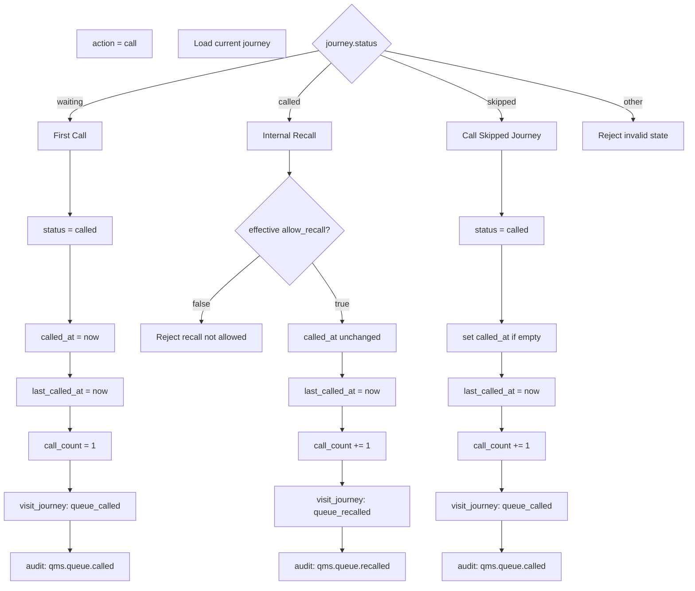
```mermaid
flowchart TD
    A[action = call]
    B[Load current journey]
    C{journey.status}

    C -->|waiting| D[First Call]
    C -->|called| E[Internal Recall]
    C -->|skipped| F[Call Skipped Journey]
    C -->|other| X[Reject invalid state]

    D --> D1[status = called]
    D1 --> D2[called_at = now]
    D2 --> D3[last_called_at = now]
    D3 --> D4[call_count = 1]
    D4 --> D5[visit_journey: queue_called]
    D5 --> D6[audit: qms.queue.called]

    E --> E1{effective allow_recall?}
    E1 -->|false| E2[Reject recall not allowed]
    E1 -->|true| E3[called_at unchanged]
    E3 --> E4[last_called_at = now]
    E4 --> E5[call_count += 1]
    E5 --> E6[visit_journey: queue_recalled]
    E6 --> E7[audit: qms.queue.recalled]

    F --> F1[status = called]
    F1 --> F2[set called_at if empty]
    F2 --> F3[last_called_at = now]
    F3 --> F4[call_count += 1]
    F4 --> F5[visit_journey: queue_called]
    F5 --> F6[audit: qms.queue.called]
```

---

## 12. Queue Journey State Machine

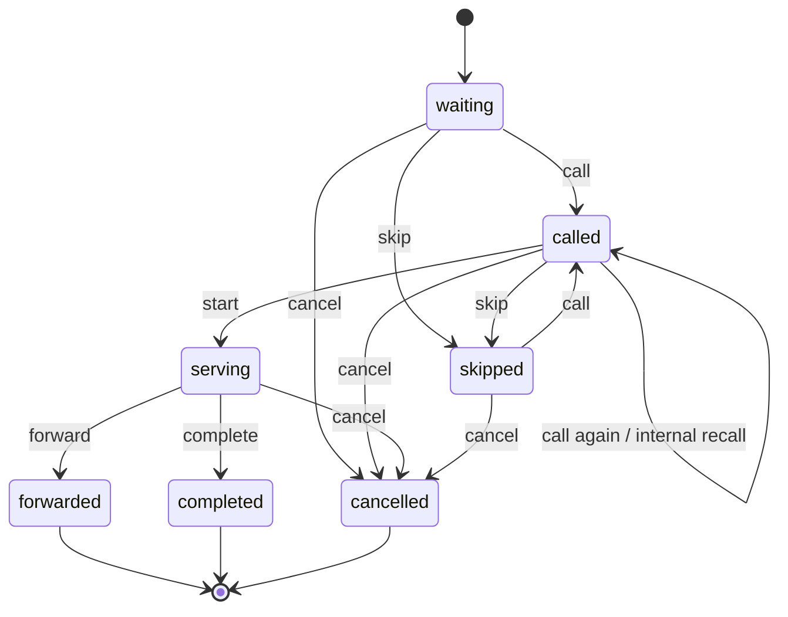
```mermaid
stateDiagram-v2
    [*] --> waiting

    waiting --> called: call
    called --> called: call again / internal recall
    skipped --> called: call

    called --> serving: start

    serving --> forwarded: forward
    forwarded --> [*]

    serving --> completed: complete
    completed --> [*]

    waiting --> skipped: skip
    called --> skipped: skip

    waiting --> cancelled: cancel
    called --> cancelled: cancel
    serving --> cancelled: cancel
    skipped --> cancelled: cancel
    cancelled --> [*]
```

---

## 13. Queue Parent Lifecycle

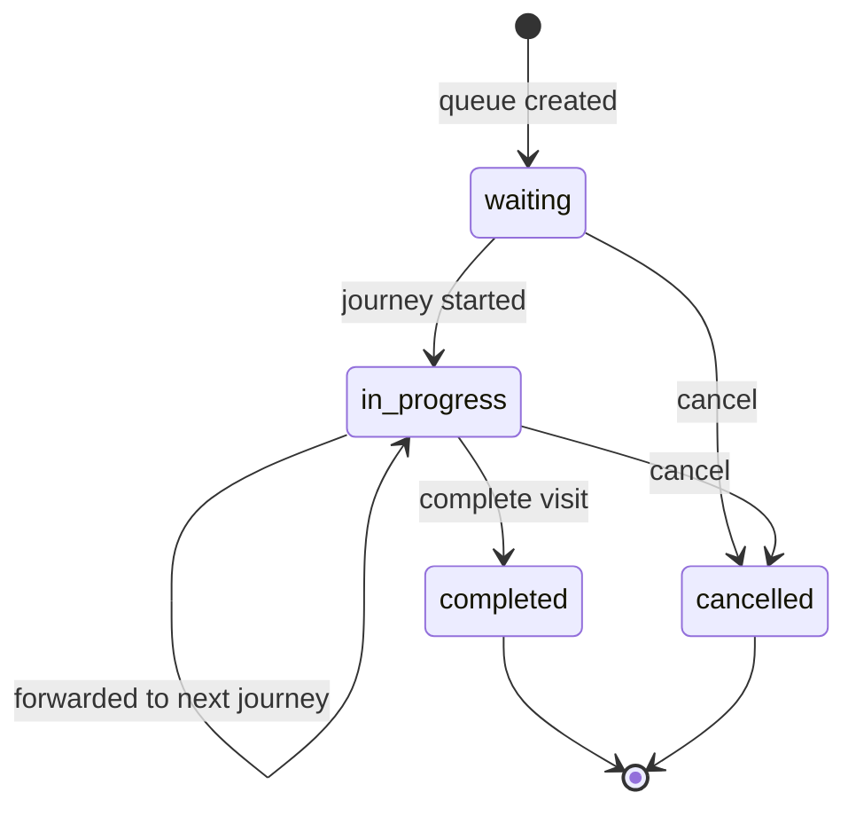
```mermaid
stateDiagram-v2
    [*] --> waiting: queue created

    waiting --> in_progress: journey started
    in_progress --> in_progress: forwarded to next journey
    in_progress --> completed: complete visit

    waiting --> cancelled: cancel
    in_progress --> cancelled: cancel

    completed --> [*]
    cancelled --> [*]
```

---

## 14. Forward Transaction Flow

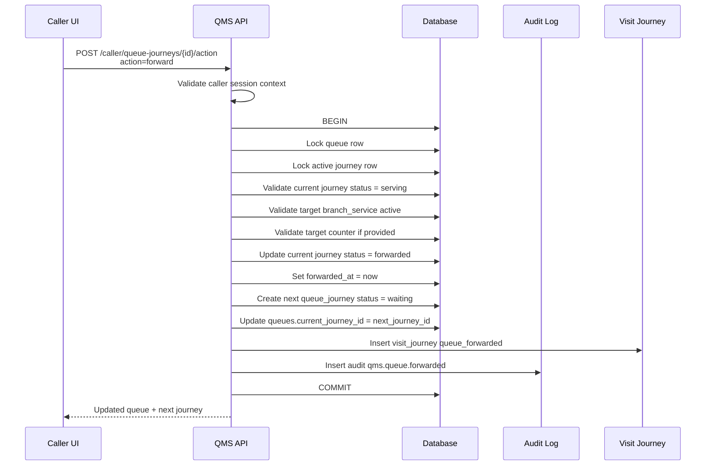
```mermaid
sequenceDiagram
    participant Caller as Caller UI
    participant API as QMS API
    participant DB as Database
    participant Audit as Audit Log
    participant Visit as Visit Journey

    Caller->>API: POST /caller/queue-journeys/{id}/action<br/>action=forward
    API->>API: Validate caller session context
    API->>DB: BEGIN
    API->>DB: Lock queue row
    API->>DB: Lock active journey row
    API->>DB: Validate current journey status = serving
    API->>DB: Validate target branch_service active
    API->>DB: Validate target counter if provided

    API->>DB: Update current journey status = forwarded
    API->>DB: Set forwarded_at = now
    API->>DB: Create next queue_journey status = waiting
    API->>DB: Update queues.current_journey_id = next_journey_id

    API->>Visit: Insert visit_journey queue_forwarded
    API->>Audit: Insert audit qms.queue.forwarded
    API->>DB: COMMIT

    API-->>Caller: Updated queue + next journey
```

---

## 15. Complete Visit Flow

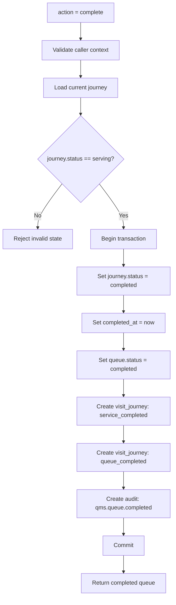
```mermaid
flowchart TD
    A[action = complete]
    B[Validate caller context]
    C[Load current journey]
    D{journey.status == serving?}
    E[Reject invalid state]
    F[Begin transaction]
    G[Set journey.status = completed]
    H[Set completed_at = now]
    I[Set queue.status = completed]
    J[Create visit_journey: service_completed]
    K[Create visit_journey: queue_completed]
    L[Create audit: qms.queue.completed]
    M[Commit]
    N[Return completed queue]

    A --> B --> C --> D
    D -->|No| E
    D -->|Yes| F --> G --> H --> I --> J --> K --> L --> M --> N
```

---

## 16. Skip Flow

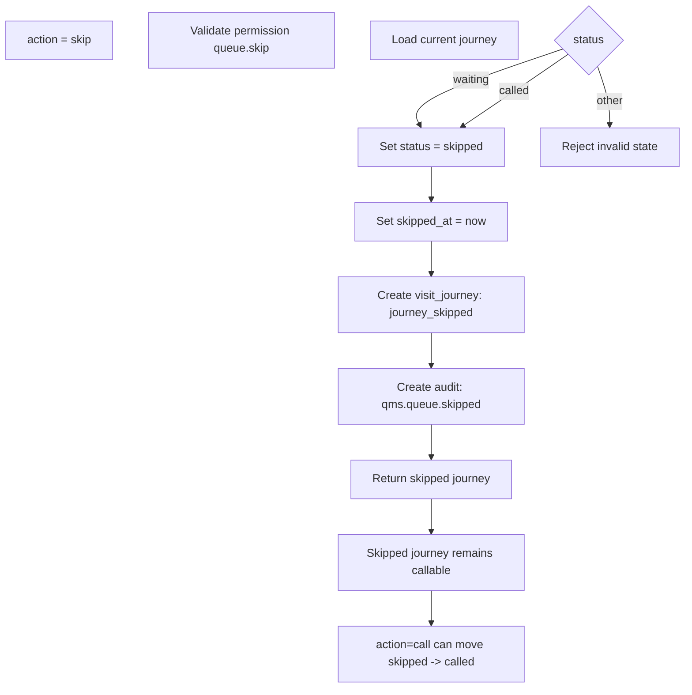
```mermaid
flowchart TD
    A[action = skip]
    B[Validate permission queue.skip]
    C[Load current journey]
    D{status}
    D -->|waiting| E[Set status = skipped]
    D -->|called| E
    D -->|other| X[Reject invalid state]

    E --> F[Set skipped_at = now]
    F --> G[Create visit_journey: journey_skipped]
    G --> H[Create audit: qms.queue.skipped]
    H --> I[Return skipped journey]

    I --> J[Skipped journey remains callable]
    J --> K[action=call can move skipped -> called]
```

---

## 17. Cancel Flow

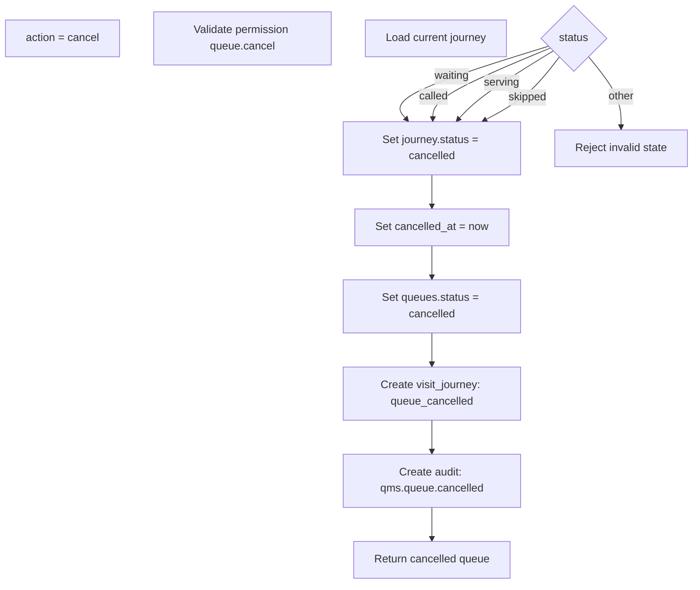
```mermaid
flowchart TD
    A[action = cancel]
    B[Validate permission queue.cancel]
    C[Load current journey]
    D{status}
    D -->|waiting| E[Set journey.status = cancelled]
    D -->|called| E
    D -->|serving| E
    D -->|skipped| E
    D -->|other| X[Reject invalid state]

    E --> F[Set cancelled_at = now]
    F --> G[Set queues.status = cancelled]
    G --> H[Create visit_journey: queue_cancelled]
    H --> I[Create audit: qms.queue.cancelled]
    I --> J[Return cancelled queue]
```

---

## 18. Estimate Time and Queue Left Calculation

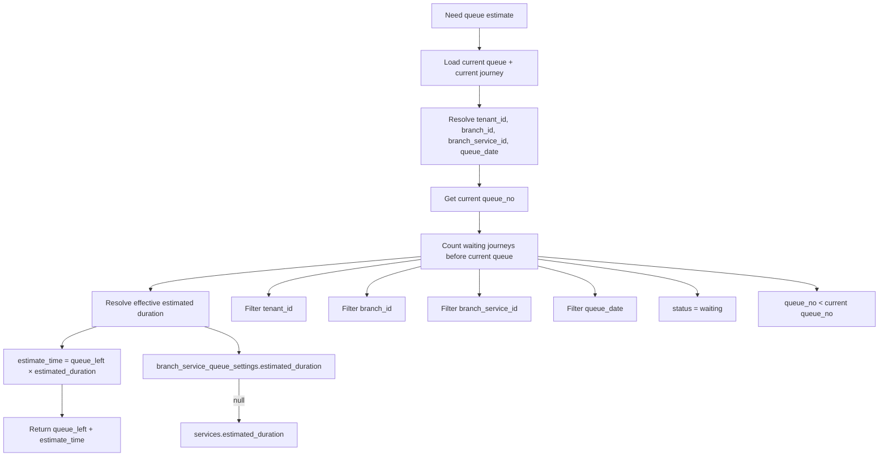
```mermaid
flowchart TD
    A[Need queue estimate]
    B[Load current queue + current journey]
    C[Resolve tenant_id, branch_id, branch_service_id, queue_date]
    D[Get current queue_no]
    E[Count waiting journeys before current queue]
    F[Resolve effective estimated duration]
    G[estimate_time = queue_left × estimated_duration]
    H[Return queue_left + estimate_time]

    A --> B --> C --> D --> E --> F --> G --> H

    E --> E1[Filter tenant_id]
    E --> E2[Filter branch_id]
    E --> E3[Filter branch_service_id]
    E --> E4[Filter queue_date]
    E --> E5[status = waiting]
    E --> E6[queue_no < current queue_no]

    F --> F1[branch_service_queue_settings.estimated_duration]
    F1 -->|null| F2[services.estimated_duration]
```

---

## 19. Queue Date Calculation

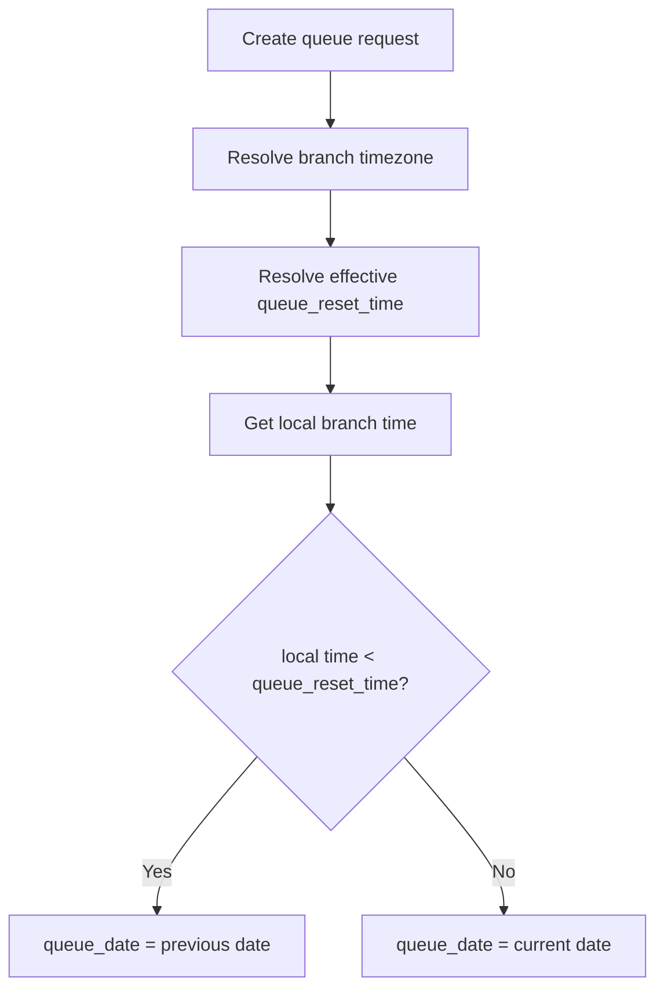
```mermaid
flowchart TD
    A[Create queue request]
    B[Resolve branch timezone]
    C[Resolve effective queue_reset_time]
    D[Get local branch time]
    E{local time < queue_reset_time?}
    F[queue_date = previous date]
    G[queue_date = current date]

    A --> B --> C --> D --> E
    E -->|Yes| F
    E -->|No| G
```

---

## 20. Signage Current Calls Flow

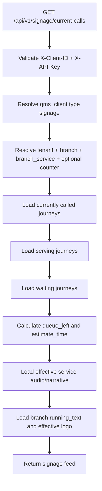
```mermaid
flowchart TD
    A[GET /api/v1/signage/current-calls]
    B[Validate X-Client-ID + X-API-Key]
    C[Resolve qms_client type signage]
    D[Resolve tenant + branch + branch_service + optional counter]
    E[Load currently called journeys]
    F[Load serving journeys]
    G[Load waiting journeys]
    H[Calculate queue_left and estimate_time]
    I[Load effective service audio/narrative]
    J[Load branch running_text and effective logo]
    K[Return signage feed]

    A --> B --> C --> D --> E --> F --> G --> H --> I --> J --> K
```

---

## 21. QMS Client Credential Validation Flow

```mermaid
flowchart TD
    A[Request with X-Client-ID + X-API-Key]
    B[Find qms_client by client_id]
    C{client exists?}
    D[Reject unauthorized]
    E{client active?}
    F[Reject inactive client]
    G[Find active credential]
    H[Hash provided API key]
    I{hash matches?}
    J[Reject invalid API key]
    K{client_type matches endpoint?}
    L[Reject wrong client type]
    M[Resolve tenant/branch/service/counter]
    N[Update last_used_at]
    O[Allow request]

    A --> B --> C
    C -->|No| D
    C -->|Yes| E
    E -->|No| F
    E -->|Yes| G --> H --> I
    I -->|No| J
    I -->|Yes| K
    K -->|No| L
    K -->|Yes| M --> N --> O
```

---

## 22. Operator Caller Login Validation

```mermaid
flowchart TD
    A[Caller login request]
    B[Validate qms client credential]
    C[Resolve client counter context]
    D[Validate username/password]
    E[Load operator user]
    F{user belongs to tenant?}
    G[Reject]
    H{user has branch access?}
    I[Reject]
    J[Find active operator_counter_assignment]
    K{assignment matches client counter?}
    L[Reject]
    M{branch_service active?}
    N[Reject]
    O[Create caller session]
    P[Return JWT + bound context]

    A --> B --> C --> D --> E --> F
    F -->|No| G
    F -->|Yes| H
    H -->|No| I
    H -->|Yes| J --> K
    K -->|No| L
    K -->|Yes| M
    M -->|No| N
    M -->|Yes| O --> P
```

---

## 23. Data Scope Enforcement

```mermaid
flowchart TB
    Req[Incoming Request]
    TenantCtx[Resolve tenant context]
    BranchCtx[Resolve branch context when applicable]
    Resource[Load resource]
    ValidateTenant{resource.tenant_id == tenant_id?}
    ValidateBranch{resource.branch_id == branch_id?}
    Allowed[Allow operation]
    Reject[Reject: cross-scope access]

    Req --> TenantCtx --> BranchCtx --> Resource --> ValidateTenant
    ValidateTenant -->|No| Reject
    ValidateTenant -->|Yes| ValidateBranch
    ValidateBranch -->|No| Reject
    ValidateBranch -->|Yes| Allowed
```

---

## 24. Audit and Visit Journey Separation

```mermaid
flowchart LR
    Action[QMS Action]
    DomainUpdate[Domain State Update]
    Visit[visit_journeys]
    Audit[audit_logs]
    Logs[structured error logs]

    Action --> DomainUpdate
    DomainUpdate --> Visit
    DomainUpdate --> Audit

    Visit -->|Readable operational timeline| QueueDetail[Queue Detail UI]
    Audit -->|Accountability / security| AdminAudit[Admin Audit UI]

    Action -.on failure.-> Logs
```

---

## 25. Audit Logging Transaction Pattern

```mermaid
sequenceDiagram
    participant API as QMS API
    participant DB as Database
    participant Visit as Visit Journey
    participant Audit as Audit Log

    API->>DB: BEGIN
    API->>DB: Update domain state
    API->>Visit: Insert visit_journey
    API->>Audit: Insert audit_log
    API->>DB: COMMIT

    alt Any operation fails
        API->>DB: ROLLBACK
        API->>API: Write structured error log
        API-->>API: Return safe error response
    end
```

---

## 26. Dashboard Metrics Data Source

```mermaid
flowchart TB
    Queues[queues]
    Journeys[queue_journeys]
    Visits[visit_journeys]

    Queues --> Total[Total queues today]
    Queues --> Completed[Completed visits]
    Queues --> Cancelled[Cancelled visits]

    Journeys --> Waiting[Waiting journeys]
    Journeys --> Called[Called journeys]
    Journeys --> Serving[Serving journeys]
    Journeys --> Skipped[Skipped journeys]
    Journeys --> Forwarded[Forwarded journeys]
    Journeys --> ServiceDuration[Average service duration]

    Visits --> Timeline[Queue timeline]
    Visits --> OperationalHistory[Operational history]

    Total --> Dashboard[Dashboard UI]
    Completed --> Dashboard
    Cancelled --> Dashboard
    Waiting --> Dashboard
    Called --> Dashboard
    Serving --> Dashboard
    Skipped --> Dashboard
    Forwarded --> Dashboard
    ServiceDuration --> Dashboard
```

---

## 27. API Grouping Map

```mermaid
flowchart TB
    API[QMS API]

    API --> Manage[Dashboard / Manage APIs]
    API --> Caller[Caller APIs]
    API --> Signage[Signage APIs]

    Manage --> TenantAPI[Tenant Profile + Queue Settings]
    Manage --> BranchAPI[Branch Profile + Queue Settings]
    Manage --> ServiceAPI[Services]
    Manage --> BranchServiceAPI[Branch Services]
    Manage --> CounterAPI[Counters]
    Manage --> ClientAPI[QMS Clients]
    Manage --> AssignmentAPI[Operator Assignments]
    Manage --> QueueAdminAPI[Queue List + Detail + Timeline]
    Manage --> DashboardAPI[Dashboard Metrics]

    Caller --> CallerLogin[POST /caller/login]
    Caller --> CallerMe[GET /caller/me]
    Caller --> CallerQueue[GET /caller/queue-journeys]
    Caller --> CallerCurrent[GET /caller/current]
    Caller --> CallerAction[POST /caller/queue-journeys/:id/action]

    Signage --> SignageMe[GET /signage/me]
    Signage --> SignageCalls[GET /signage/current-calls]
    Signage --> SignageQueues[GET /signage/queues]
```

---

## 28. NEW Deployment Boundary

```mermaid
flowchart TB
    subgraph ClientApps["Client Applications"]
        DashboardUI[Dashboard UI]
        CallerUI[Caller UI]
        SignageUI[Signage UI]
    end

    subgraph Backend["Backend"]
        API[HTTP API]
        Auth[User Auth + RBAC]
        QMSClientAuth[QMS Client Credential Auth]
        QueueService[Queue Service]
        ConfigResolver[Effective Config Resolver]
        AuditService[Audit Service]
        VisitService[Visit Journey Service]
        DashboardService[Dashboard Service]
    end

    subgraph Storage["Storage"]
        DB[(Relational Database)]
        AssetStore[(Asset/File Store)]
    end

    DashboardUI --> API
    CallerUI --> API
    SignageUI --> API

    API --> Auth
    API --> QMSClientAuth
    API --> QueueService
    API --> ConfigResolver
    QueueService --> VisitService
    QueueService --> AuditService
    API --> DashboardService

    QueueService --> DB
    ConfigResolver --> DB
    AuditService --> DB
    VisitService --> DB
    DashboardService --> DB

    API --> AssetStore
```

---

# NEW Diagram Summary

Diagram NEW ini mencakup:

```text
1. High-level system context
2. New ERD
3. Typed configuration hierarchy
4. MVP operational flow
5. Setup wizard flow
6. Dashboard / Caller / Signage boundary
7. Caller authentication flow
8. Signage authentication flow
9. Create queue request logic
10. Caller single action endpoint flow
11. Call and internal recall logic
12. Queue journey state machine
13. Queue parent lifecycle
14. Forward transaction flow
15. Complete visit flow
16. Skip flow
17. Cancel flow
18. Estimate time and queue left calculation
19. Queue date calculation
20. Signage current calls flow
21. QMS client credential validation
22. Operator caller login validation
23. Data scope enforcement
24. Audit and visit journey separation
25. Audit transaction pattern
26. Dashboard metrics data source
27. API grouping map
28. Deployment boundary
```

lanjut lihat diagram `QMS NEW Design Diagrams.md`
