**`QMS_Rebuild_Multi_Tenant_Queue_Architecture_Document.md`**

# QMS Rebuild Architecture Document

## Multi-Tenant Queue Management System

## 1. Document Purpose

Dokumen ini mendefinisikan **arsitektur rebuild** untuk sistem queue management berbasis multi-tenant.

Fokus utama dokumen ini:

1. Multi-tenant architecture.
2. Semua fitur wajib scoped by tenant.
3. Branch berada di bawah tenant.
4. Queue tidak membuat record baru saat forwarding.
5. Forwarding menggunakan normalized `queue_journeys`.
6. Satu queue record hanya memiliki satu ticket dan satu queue number per hari.
7. Configuration dan setting tenant/branch harus mudah dipahami dari sisi UX dan API.
8. Tidak membahas integrasi eksternal seperti Medifrans atau Bithealth.
9. Satu-satunya istilah “journey” yang masuk dokumen ini adalah **internal visit/queue journey**, bukan integrasi eksternal.

---

# 2. Architecture Principles

## 2.1 Tenant First

Semua data utama wajib memiliki `tenant_id`.

Tenant adalah boundary utama untuk:

- user access;
- branch;
- queue;
- patient/customer;
- counter/station;
- menu/service;
- role;
- permission;
- configuration;
- visit journey;
- audit log.

Tidak boleh ada query bisnis tanpa tenant scope.

```text
Every request must resolve tenant context first.
Every repository query must filter by tenant_id.
Every mutation must write tenant_id.
Every relationship must validate tenant ownership.
```

---

## 2.2 Branch Under Tenant

Branch tidak berdiri sendiri.

```text
Tenant
  └── Branch
        └── Service/Menu
        └── Counter/Station
        └── Queue
        └── Branch Configuration
```

Branch hanya valid jika `branches.tenant_id = request.tenant_id`.

---

## 2.3 One Queue Record Per Ticket Per Day

Sistem baru tidak boleh membuat banyak queue record untuk satu ticket di hari yang sama.

Bad old-style design:

```text
customer_queue #1
  ticket = A001
  queue = 1
  menu = Registration

forwarded to pharmacy

customer_queue #2
  ticket = A002
  queue = 2
  menu = Pharmacy
```

Target design:

```text
queues
  id = 100
  ticket_no = A001
  queue_no = 1
  tenant_id = 1
  branch_id = 10
  queue_date = 2026-06-22

queue_journeys
  queue_id = 100
  step 1 = Registration
  step 2 = Pharmacy
```

Satu pasien/ticket tetap satu `queues` record. Perpindahan antar layanan dicatat di `queue_journeys`.

---

## 2.4 Forwarding Is Journey, Not New Queue

Forwarding tidak boleh create queue baru.

Forwarding berarti:

```text
Close current active queue_journey
Create next queue_journey
Keep same queue_id
Keep same ticket_no
Keep same queue_no
```

Queue number dan ticket tidak berubah saat pasien berpindah layanan.

---

## 2.5 Configuration Must Be UX Friendly

Setting harus mengikuti hierarchy yang mudah dipahami:

```text
Tenant Default Setting
  ↓ inherited by
Branch Setting
  ↓ optionally overrides
Service/Menu Setting
  ↓ optionally overrides
Counter/Station Setting
```

UX harus bisa menampilkan:

```text
This branch uses tenant default.
This branch overrides queue reset time.
This service overrides estimated duration.
This station overrides display name.
```

---

# 3. Starter-Compatible Module Architecture

Dokumen ini diasumsikan mengikuti starter modular dengan separation seperti berikut:

```text
cmd/
  api/
    main.go

internal/
  app/
    bootstrap.go
    router.go
    module.go

  shared/
    tenant/
    auth/
    response/
    errors/
    pagination/
    transaction/
    config/
    audit/

  modules/
    tenants/
    branches/
    users/
    roles/
    permissions/
    settings/
    services/
    counters/
    queues/
    visit_journeys/
    dashboards/
```

Jika starter kamu memakai nama berbeda, mapping-nya tetap sama:

| Architecture Concept | Starter Layer            |
| -------------------- | ------------------------ |
| HTTP endpoint        | route/controller/handler |
| Business process     | service/usecase          |
| DB access            | repository/data          |
| DB model             | entity/model             |
| Request response     | dto/contract             |
| Module wiring        | module/provider/factory  |

---

# 4. Target High-Level Architecture

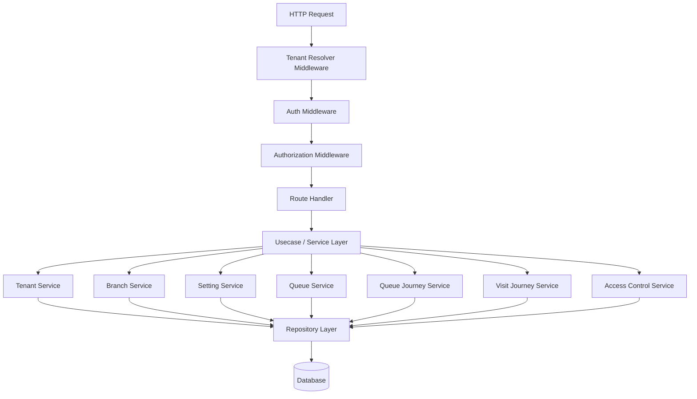

---

# 5. Tenant Context Architecture

## 5.1 Tenant Resolution

Tenant context can be resolved from one of these strategies:

1. Subdomain
   Example: `tenant-a.qms.app`

2. Header
   Example: `X-Tenant-ID: tenant-a`

3. JWT claim
   Example: `tenant_id` inside access token

4. Explicit path for admin APIs
   Example: `/admin/tenants/{tenant_id}`

Recommended default:

```text
Normal user request:
JWT claim tenant_id + branch_ids

Super admin request:
explicit tenant_id path/query allowed
```

---

## 5.2 Tenant Context Object

Every request should carry:

```text
TenantContext
- tenant_id
- tenant_code
- user_id
- role_id
- allowed_branch_ids
- active_branch_id
- is_super_admin
```

No service should accept only `branch_id` without `tenant_id`.

Bad:

```text
GetQueueByBranch(branch_id)
```

Good:

```text
GetQueueByBranch(tenant_id, branch_id)
```

---

# 6. Multi-Tenant Data Ownership

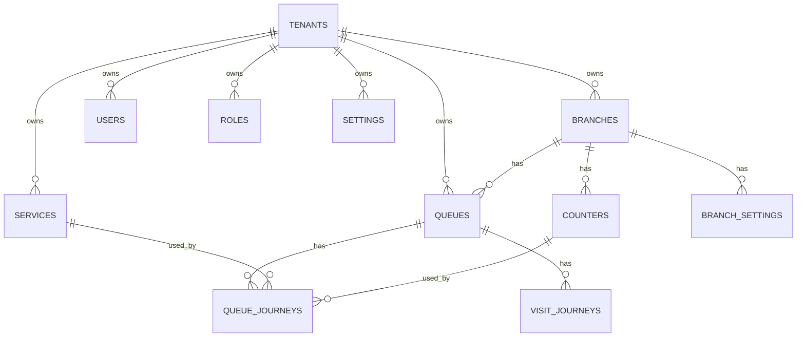

---

# 7. Core Domain Model

## 7.1 Tenants

Purpose: organization/company/hospital owner.

Recommended fields:

```text
tenants
- id
- code
- name
- legal_name
- status
- timezone
- default_locale
- created_at
- updated_at
- deleted_at
```

---

## 7.2 Branches

Purpose: physical branch/location under tenant.

```text
branches
- id
- tenant_id
- code
- name
- address
- timezone
- status
- created_at
- updated_at
- deleted_at
```

Rule:

```text
branch.tenant_id must always match request.tenant_id
```

---

## 7.3 Services / Menus

Purpose: queue destination such as registration, doctor, pharmacy, cashier.

Use one normalized domain name: **services**.

```text
services
- id
- tenant_id
- branch_id nullable
- code
- name
- type
- is_pharmacy
- is_pharmacy_reception
- default_estimated_duration
- status
- created_at
- updated_at
```

Design rule:

- `branch_id = null` means tenant-level reusable service template.
- `branch_id != null` means branch-specific service.

---

## 7.4 Counters / Stations

Purpose: service point, counter, room, station, or locket.

```text
counters
- id
- tenant_id
- branch_id
- service_id
- code
- name
- display_name
- status
- created_at
- updated_at
```

Rule:

```text
counter.branch_id must belong to same tenant.
counter.service_id must belong to same tenant.
```

---

# 8. Queue Architecture

## 8.1 Queues Table

`queues` is the main ticket identity table.

It represents one patient visit / one queue ticket for one branch and one business day.

```text
queues
- id
- tenant_id
- branch_id
- queue_date
- ticket_no
- queue_no
- patient_ref
- patient_name
- source
- priority
- status
- current_journey_id
- created_at
- updated_at
- deleted_at
```

Important:

```text
queues.ticket_no must not change during forwarding.
queues.queue_no must not change during forwarding.
queues.current_journey_id points to active queue_journey.
```

Recommended unique constraint:

```text
unique tenant_id + branch_id + queue_date + ticket_no
unique tenant_id + branch_id + queue_date + queue_no
```

This ensures no duplicate queue number and no duplicate ticket in the same branch/day.

---

## 8.2 Queue Status

Queue-level status describes the whole visit.

```text
draft
waiting
in_progress
completed
cancelled
```

Recommended meaning:

| Status        | Meaning                               |
| ------------- | ------------------------------------- |
| `draft`       | queue created but not activated       |
| `waiting`     | queue is active and waiting somewhere |
| `in_progress` | at least one journey is being served  |
| `completed`   | visit completed                       |
| `cancelled`   | whole queue cancelled                 |

---

## 8.3 Queue Journeys Table

`queue_journeys` records every movement/forwarding/service step.

```text
queue_journeys
- id
- tenant_id
- branch_id
- queue_id
- service_id
- counter_id nullable
- sequence_no
- status
- source_journey_id nullable
- forward_reason nullable
- called_at nullable
- started_at nullable
- completed_at nullable
- cancelled_at nullable
- created_by nullable
- created_at
- updated_at
```

Important:

```text
Forwarding creates queue_journeys, not queues.
```

---

## 8.4 Journey Status

Journey-level status describes current service step.

```text
waiting
called
serving
completed
skipped
cancelled
forwarded
```

State machine:

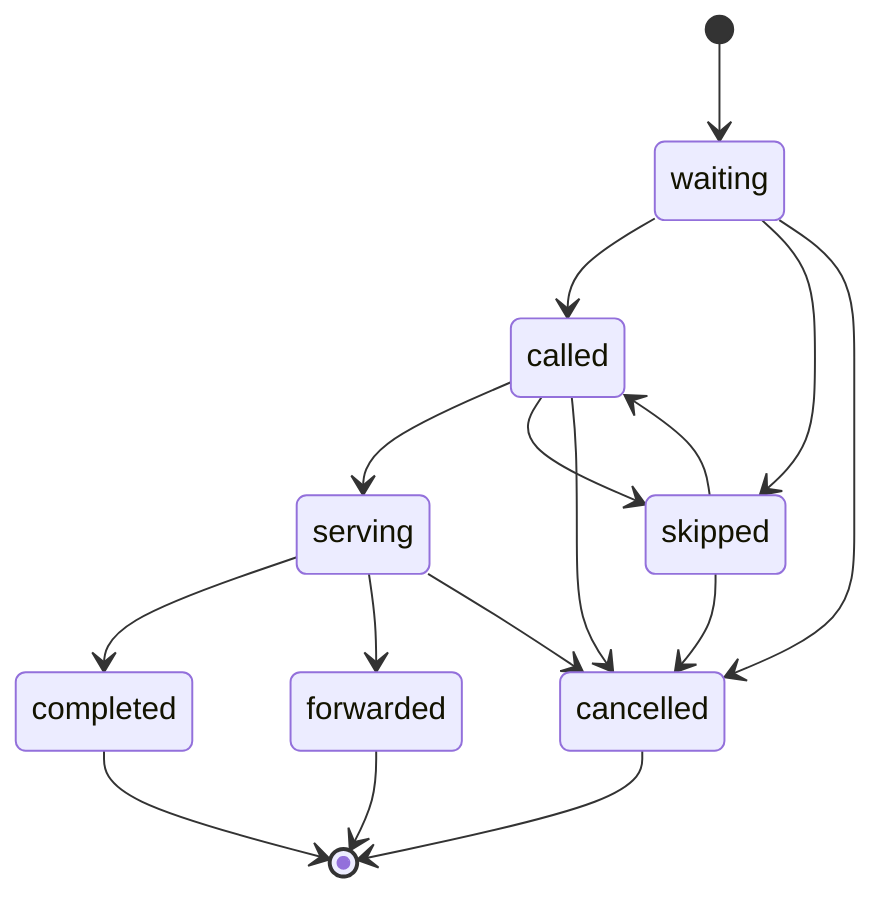

---

# 9. Forwarding Architecture

## 9.1 Forwarding Rule

Forwarding means:

```text
Current queue_journey becomes forwarded/completed.
New queue_journey is created.
Same queue_id is used.
Same ticket_no is used.
Same queue_no is used.
```

---

## 9.2 Forward Flow

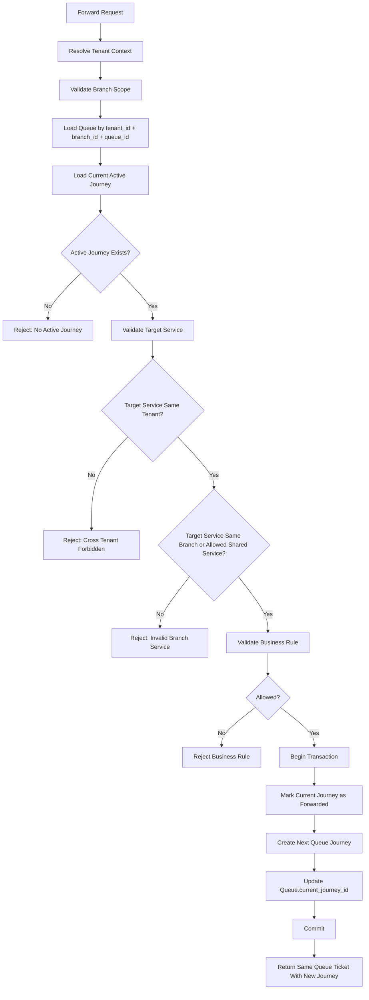

---

## 9.3 Forward Response

Forward response should make UX clear:

```json
{
  "queue_id": "uuid",
  "ticket_no": "A001",
  "queue_no": 1,
  "current_journey": {
    "id": "journey_uuid",
    "service_name": "Pharmacy",
    "counter_name": null,
    "status": "waiting"
  },
  "message": "Queue forwarded successfully"
}
```

---

# 10. Visit Journey Architecture

`visit_journeys` is an internal readable history of queue movement.

It can be generated from `queue_journeys`, or stored as an audit-like projection.

Recommended design:

```text
visit_journeys
- id
- tenant_id
- branch_id
- queue_id
- queue_journey_id
- event_type
- title
- description
- metadata_json
- occurred_at
- created_at
```

Example event types:

```text
queue_created
journey_created
queue_called
service_started
service_completed
queue_forwarded
queue_cancelled
```

Important:

```text
visit_journeys is internal domain history.
Do not place external integration logic here.
```

---

# 11. Queue Number Architecture

Queue number should be generated once per queue.

Forwarding must not generate a new queue number.

## 11.1 Queue Counter

```text
queue_counters
- id
- tenant_id
- branch_id
- queue_date
- prefix
- current_number
- created_at
- updated_at
```

Recommended unique constraint:

```text
unique tenant_id + branch_id + queue_date + prefix
```

Queue number generation:

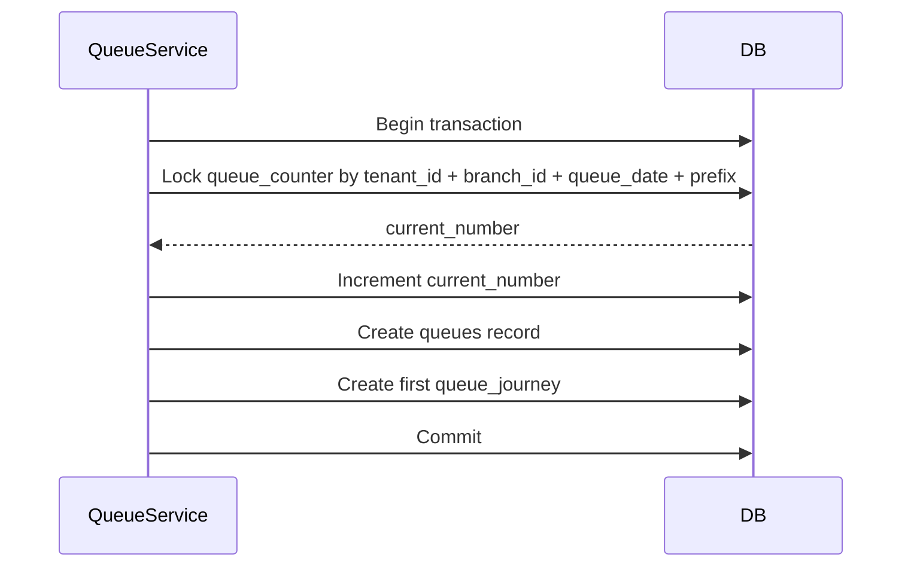

---

# 12. Queue Creation Architecture

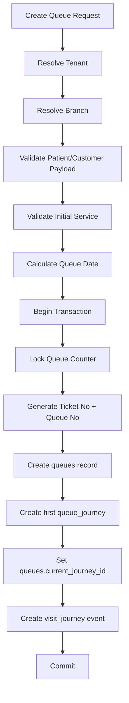

---

# 13. Queue Date Rule

Queue date must be consistent across tenant/branch.

Recommended:

```text
tenant.default_queue_reset_time = 04:00
branch.queue_reset_time can override tenant default
```

Queue date calculation:

```text
If current local branch time is before reset_time:
    queue_date = previous date
Else:
    queue_date = current date
```

This supports hospitals/clinics that operate past midnight.

---

# 14. Configuration Architecture

## 14.1 Configuration Levels

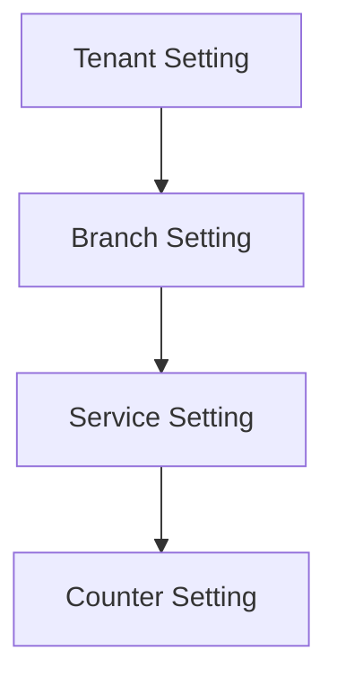

Inheritance rule:

```text
counter setting overrides service setting
service setting overrides branch setting
branch setting overrides tenant setting
tenant setting is fallback
```

---

## 14.2 Setting Types

Recommended setting categories:

```text
queue
- queue_reset_time
- ticket_prefix
- numbering_strategy
- allow_duplicate_patient_per_day
- default_priority
- default_estimated_duration

display
- branch_display_name
- counter_display_name
- queue_screen_theme
- language

workflow
- allow_forward
- allow_skip
- allow_recall
- require_counter_for_service
- pharmacy_flow_enabled

security
- session_timeout
- allowed_ip_ranges
- branch_access_policy
```

---

## 14.3 Settings Table

Use normalized setting table for flexibility:

```text
settings
- id
- tenant_id
- scope_type
- scope_id
- key
- value
- value_type
- is_active
- created_at
- updated_at
```

Where:

```text
scope_type = tenant | branch | service | counter
scope_id = related id
```

Example:

```text
tenant queue_reset_time = 04:00
branch queue_reset_time = 05:00
service default_estimated_duration = 7
counter display_name = Counter A
```

---

# 15. UX-Oriented Configuration Flow

## 15.1 UX Goal

Admin should understand settings like this:

```text
Tenant: RS Sehat
  Default queue reset time: 04:00
  Default ticket prefix: A

Branch: Jakarta Selatan
  Uses tenant queue reset time
  Overrides ticket prefix: JS

Service: Pharmacy
  Estimated duration: 8 minutes
  Pharmacy flow: enabled
```

---

## 15.2 API Flow for Settings

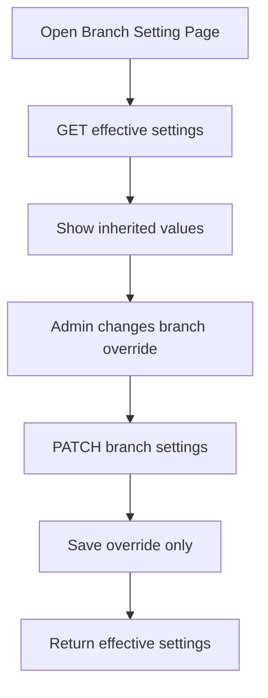

---

## 15.3 Effective Settings Response

API should return both inherited and overridden values:

```json
{
  "scope": "branch",
  "scope_id": "branch_uuid",
  "settings": {
    "queue_reset_time": {
      "value": "04:00",
      "source": "tenant",
      "is_overridden": false
    },
    "ticket_prefix": {
      "value": "JS",
      "source": "branch",
      "is_overridden": true
    }
  }
}
```

This makes UX much easier because frontend can show:

```text
Inherited from tenant
Overridden at branch
```

---

# 16. Access Control Architecture

Access must be tenant-aware and branch-aware.

## 16.1 User Scope

```text
users
- id
- tenant_id
- name
- email
- status
```

```text
user_branch_access
- user_id
- tenant_id
- branch_id
```

A user can access:

```text
one tenant + one branch
one tenant + multiple branches
one tenant + all branches
super admin + multiple tenants
```

---

## 16.2 Authorization Rule

Every request must check:

```text
Can user access tenant?
Can user access branch?
Can user perform action?
```

Do not check role only.

Bad:

```text
role can read queue
```

Good:

```text
user has role permission read queue
AND user belongs to tenant
AND user can access requested branch
```

---

# 17. Branch-Scoped Feature Architecture

Every branch-scoped module must follow the same rule:

```text
tenant_id is mandatory.
branch_id is mandatory when feature is branch-owned.
```

Branch-scoped modules:

```text
queues
queue_journeys
visit_journeys
counters
branch settings
branch dashboards
branch users/access
```

Tenant-scoped modules:

```text
tenants
global services/templates
roles
permissions
tenant settings
tenant users
```

---

# 18. API Architecture

## 18.1 API Grouping

Recommended API structure:

```text
/api/v1/tenant
/api/v1/branches
/api/v1/settings
/api/v1/services
/api/v1/counters
/api/v1/queues
/api/v1/queue-journeys
/api/v1/visit-journeys
/api/v1/users
/api/v1/roles
/api/v1/permissions
```

Tenant comes from JWT context, not always from URL.

For super admin:

```text
/api/v1/admin/tenants
/api/v1/admin/tenants/{tenant_id}/branches
```

---

## 18.2 Branch Context

For normal branch operation:

```text
X-Branch-ID: branch_uuid
```

or:

```text
/api/v1/branches/{branch_id}/queues
```

Recommended for clarity:

```text
/api/v1/branches/{branch_id}/queues
/api/v1/branches/{branch_id}/settings
/api/v1/branches/{branch_id}/counters
```

---

# 19. Queue API Architecture

## 19.1 Create Queue

```text
POST /api/v1/branches/{branch_id}/queues
```

Purpose:

```text
Create one queue ticket and first queue journey.
```

---

## 19.2 Forward Queue

```text
POST /api/v1/branches/{branch_id}/queues/{queue_id}/forward
```

Purpose:

```text
Create next queue_journey.
Do not create a new queue.
Do not change ticket_no.
Do not change queue_no.
```

---

## 19.3 Queue Journey Action

```text
POST /api/v1/branches/{branch_id}/queues/{queue_id}/journeys/{journey_id}/call
POST /api/v1/branches/{branch_id}/queues/{queue_id}/journeys/{journey_id}/start
POST /api/v1/branches/{branch_id}/queues/{queue_id}/journeys/{journey_id}/complete
POST /api/v1/branches/{branch_id}/queues/{queue_id}/journeys/{journey_id}/skip
POST /api/v1/branches/{branch_id}/queues/{queue_id}/journeys/{journey_id}/cancel
```

Reason:

```text
Actions belong to journey, not queue.
Queue is the parent ticket.
Journey is the current workflow step.
```

---

# 20. Dashboard Architecture

Dashboard must aggregate by tenant and branch.

```text
Tenant Dashboard
- total branches
- total queues today across branches
- average wait time
- active queues by branch

Branch Dashboard
- total queues today
- waiting queues by service
- active counters
- completed journeys
- skipped journeys
```

Dashboard queries must always include:

```text
tenant_id
branch_id when branch dashboard
queue_date
```

---

# 21. Data Isolation Rules

Every repository method must satisfy this rule:

```text
WHERE tenant_id = ?
```

For branch-owned resources:

```text
WHERE tenant_id = ? AND branch_id = ?
```

Never trust `branch_id` alone.

---

# 22. Recommended Database Relationship Summary

```text
tenants
  has many branches
  has many users
  has many roles
  has many settings
  has many services
  has many queues

branches
  belongs to tenant
  has many counters
  has many queues
  has many branch settings

services
  belongs to tenant
  optionally belongs to branch
  has many queue journeys

counters
  belongs to tenant
  belongs to branch
  belongs to service

queues
  belongs to tenant
  belongs to branch
  has many queue journeys
  has many visit journeys

queue_journeys
  belongs to tenant
  belongs to branch
  belongs to queue
  belongs to service
  optionally belongs to counter
  optionally belongs to source journey

visit_journeys
  belongs to tenant
  belongs to branch
  belongs to queue
  optionally belongs to queue journey
```

---

# 23. Architecture Decisions

## ADR-001: Tenant Is Mandatory Boundary

Decision:

```text
All business data must include tenant_id.
```

Reason:

```text
Prevents accidental cross-tenant data leakage.
Makes authorization and data filtering predictable.
```

---

## ADR-002: Branch Belongs To Tenant

Decision:

```text
branch_id is never valid without tenant_id.
```

Reason:

```text
Multi-branch support must not break tenant isolation.
```

---

## ADR-003: Forwarding Uses Queue Journey

Decision:

```text
Forwarding creates queue_journeys, not queues.
```

Reason:

```text
Prevents duplicate queue records, duplicate ticket numbers, and confusing patient history.
```

---

## ADR-004: Queue Number Generated Once

Decision:

```text
queue_no and ticket_no are generated only when queues record is created.
```

Reason:

```text
A patient should keep the same ticket during the whole visit.
```

---

## ADR-005: Settings Use Inheritance

Decision:

```text
tenant → branch → service → counter
```

Reason:

```text
Makes UX simpler and avoids duplicated configuration.
```

---

# 24. Non-Goals

This architecture document does not cover:

```text
- Medifrans integration
- Bithealth integration
- third-party API sync
- notification provider design
- detailed Go implementation code
- migration scripts
- endpoint handler code
```

Allowed exception:

```text
visit_journeys as internal queue history.
```

---

# 25. Final Target Architecture Summary

The rebuilt system should be:

```text
Multi-tenant by default.
Branch-aware by design.
Queue-safe by normalization.
Forwarding-safe by queue_journeys.
UX-friendly through inherited settings.
Starter-compatible through modular architecture.
```

The most important change from the old project is:

```text
Old:
Forwarding creates another customer/queue record.

New:
Forwarding keeps the same queue record and creates a queue_journey.
```

This design avoids:

```text
multiple queue numbers in one visit,
multiple tickets in one day,
duplicate queue records,
messy forwarding history,
hard-to-debug branch configuration,
and weak tenant isolation.
```

Lanjutannya di bawah ini. Ini masih **fokus dokumen arsitektur saja**, bukan implementasi code, dan tetap mengikuti arah rebuild: **multi-tenant, branch under tenant, normalized queue journey, no duplicate queue/ticket saat forwarding, dan configuration yang UX-friendly**.

---

# 26. Database Architecture Blueprint

## 26.1 Core Tables

```text id="1lxjjb"
tenants
branches
users
roles
permissions
role_permissions
user_branch_access

services
counters

settings

queues
queue_journeys
visit_journeys
queue_counters

audit_logs
```

---

## 26.2 Tenant-Owned Tables

Semua table berikut wajib punya `tenant_id`:

```text id="5krqxy"
branches
users
roles
permissions
role_permissions
user_branch_access
services
counters
settings
queues
queue_journeys
visit_journeys
queue_counters
audit_logs
```

Rule utama:

```text id="kfygfq"
No tenant_id, no business data.
```

---

# 27. Recommended ERD

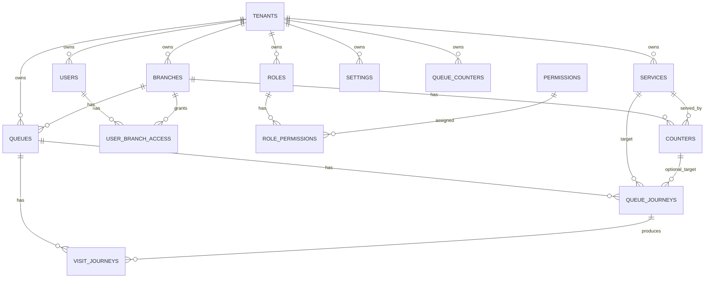

---

# 28. Queue Data Model Detail

## 28.1 `queues`

`queues` adalah parent record untuk satu ticket kunjungan.

```text id="np9yl7"
queues
- id
- tenant_id
- branch_id
- queue_date
- ticket_no
- queue_no
- patient_ref
- patient_name
- patient_phone
- source
- priority
- status
- current_journey_id
- created_by
- created_at
- updated_at
- deleted_at
```

## 28.2 Queue Rules

```text id="xw00gg"
1 queue = 1 ticket.
1 queue = 1 queue number.
Forwarding does not create queue.
Forwarding creates queue_journey.
```

## 28.3 Queue Unique Constraints

```text id="rtxvgn"
UNIQUE tenant_id + branch_id + queue_date + ticket_no
UNIQUE tenant_id + branch_id + queue_date + queue_no
```

Optional jika patient reference tersedia:

```text id="asvs5f"
UNIQUE tenant_id + branch_id + queue_date + patient_ref
```

Catatan: constraint patient harus dipakai hati-hati, karena satu pasien mungkin boleh punya lebih dari satu visit dalam satu hari tergantung kebutuhan bisnis.

---

# 29. Queue Journey Data Model Detail

## 29.1 `queue_journeys`

```text id="zm3wu4"
queue_journeys
- id
- tenant_id
- branch_id
- queue_id
- service_id
- counter_id
- sequence_no
- status
- source_journey_id
- forward_reason
- called_at
- started_at
- completed_at
- skipped_at
- cancelled_at
- created_by
- created_at
- updated_at
```

## 29.2 Journey Sequence

Example:

```text id="68rhwx"
Queue:
A001

Journey 1:
Registration / waiting → serving → forwarded

Journey 2:
Doctor Consultation / waiting → serving → forwarded

Journey 3:
Pharmacy / waiting → serving → completed
```

Queue tetap satu.

Ticket tetap satu.

Queue number tetap satu.

Journey bertambah sesuai movement.

---

# 30. Queue vs Queue Journey Responsibility

| Area                        | Belongs To                    |
| --------------------------- | ----------------------------- |
| Ticket number               | `queues`                      |
| Queue number                | `queues`                      |
| Patient identity            | `queues`                      |
| Branch ownership            | `queues` and `queue_journeys` |
| Current active step         | `queue_journeys`              |
| Forward history             | `queue_journeys`              |
| Service destination         | `queue_journeys`              |
| Counter/station destination | `queue_journeys`              |
| Call/start/complete status  | `queue_journeys`              |
| Visit history display       | `visit_journeys`              |

---

# 31. Queue Lifecycle Architecture

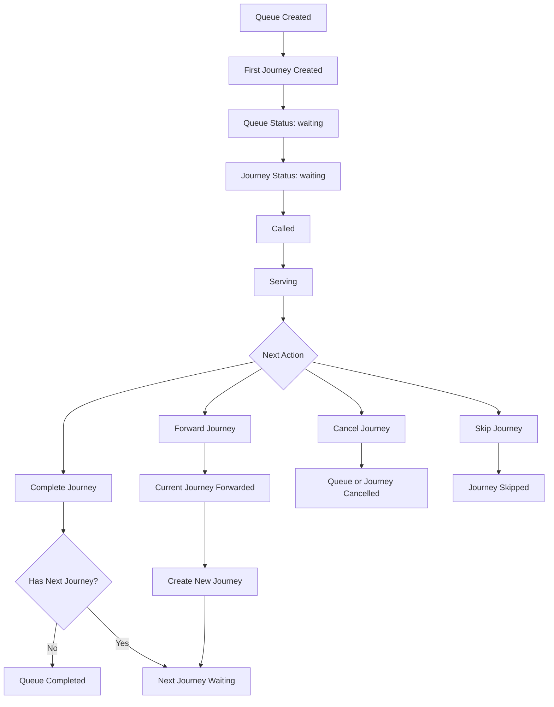

---

# 32. Forwarding Architecture Detail

## 32.1 Forwarding Input

```text id="1oe7ac"
tenant_id from context
branch_id from route/context
queue_id
target_service_id
target_counter_id optional
forward_reason optional
operator_user_id
```

## 32.2 Forwarding Validation

```text id="tnc0d4"
Validate tenant context.
Validate branch belongs to tenant.
Validate queue belongs to tenant and branch.
Validate active journey belongs to queue.
Validate target service belongs to same tenant.
Validate target service is available for branch.
Validate target counter belongs to branch if provided.
Validate business rule.
Validate current journey can be forwarded.
```

## 32.3 Forwarding Transaction

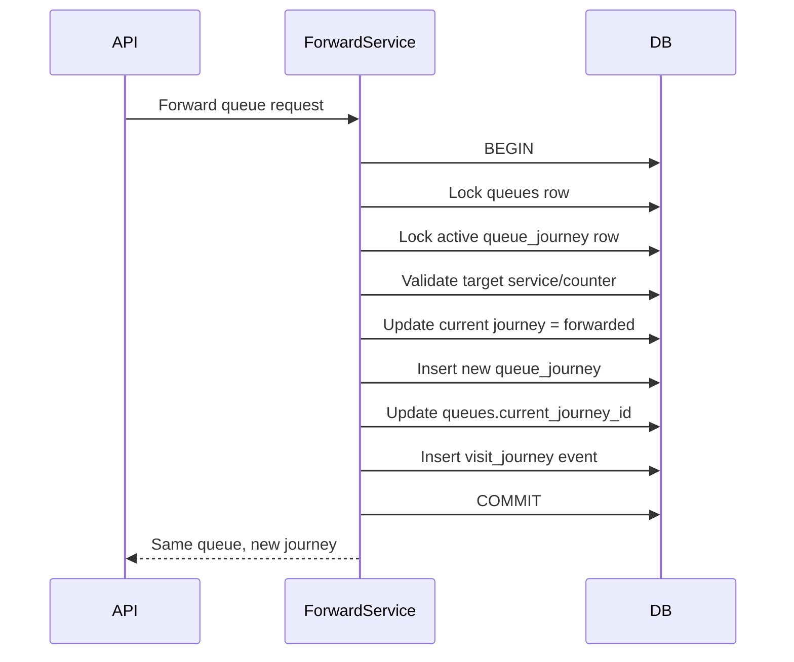

## 32.4 Forwarding Must Not

```text id="s6ftrh"
Must not create new queues record.
Must not generate new ticket_no.
Must not generate new queue_no.
Must not duplicate active journey.
Must not forward across tenant.
Must not forward to invalid branch service.
```

---

# 33. Active Journey Rule

A queue should only have one active journey at a time.

Active statuses:

```text id="2xgtrf"
waiting
called
serving
skipped
```

Terminal statuses:

```text id="i9x8tf"
completed
forwarded
cancelled
```

Recommended constraint strategy:

```text id="zvfcl1"
Only one queue_journey per queue_id can be active.
```

At database level, if supported:

```text id="tylm3e"
partial unique index:
queue_id where status in active statuses
```

If MySQL version does not support partial index easily, enforce in transaction:

```text id="p9zcwi"
SELECT active journey FOR UPDATE
```

---

# 34. Visit Journey Architecture Detail

`visit_journeys` is the readable event stream for UX/history.

It is not an external integration.

## 34.1 Visit Journey Events

```text id="avvg6b"
queue_created
journey_created
queue_called
service_started
service_completed
queue_forwarded
journey_skipped
queue_cancelled
queue_completed
```

## 34.2 Visit Journey Example

```json id="3jn45x"
[
  {
    "event_type": "queue_created",
    "title": "Queue Created",
    "description": "Ticket A001 created at Jakarta Branch"
  },
  {
    "event_type": "journey_created",
    "title": "Registration",
    "description": "Patient entered Registration queue"
  },
  {
    "event_type": "queue_forwarded",
    "title": "Forwarded to Pharmacy",
    "description": "Patient forwarded from Registration to Pharmacy"
  }
]
```

## 34.3 Visit Journey UX Purpose

Frontend can show:

```text id="84wkz7"
A001
09:00 Queue Created
09:05 Registration Started
09:12 Forwarded to Doctor
09:35 Doctor Completed
09:36 Forwarded to Pharmacy
09:50 Visit Completed
```

---

# 35. Configuration Architecture Detail

## 35.1 Setting Resolution Order

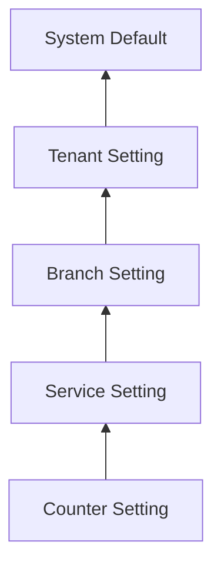

Read from top to bottom:

```text id="8edgvf"
If counter override exists, use counter.
Else if service override exists, use service.
Else if branch override exists, use branch.
Else if tenant setting exists, use tenant.
Else use system default.
```

---

## 35.2 Effective Setting Service

Architecture responsibility:

```text id="7qwmfh"
SettingService.GetEffectiveSettings(
    tenant_id,
    branch_id optional,
    service_id optional,
    counter_id optional
)
```

It should return:

```text id="84zw4t"
key
value
source_scope
source_id
is_overridden
editable_at_current_scope
```

---

## 35.3 Configuration UX Design

UX should not show raw database complexity.

Bad UX:

```text id="kj5eix"
Show all setting rows from tenant, branch, service, counter.
```

Good UX:

```text id="9v0dg7"
Show effective setting.
Show source of value.
Allow override at current scope.
Allow reset to inherited value.
```

Example:

```json id="7xoxzu"
{
  "queue_reset_time": {
    "value": "04:00",
    "source": "tenant",
    "is_overridden": false,
    "can_override": true
  },
  "ticket_prefix": {
    "value": "JKT",
    "source": "branch",
    "is_overridden": true,
    "can_reset": true
  }
}
```

---

# 36. Configuration API Architecture

## 36.1 Tenant Settings

```text id="mwlc3u"
GET    /api/v1/settings/tenant
PATCH  /api/v1/settings/tenant
```

## 36.2 Branch Settings

```text id="z13uqf"
GET    /api/v1/branches/{branch_id}/settings
PATCH  /api/v1/branches/{branch_id}/settings
DELETE /api/v1/branches/{branch_id}/settings/{key}
```

`DELETE` means reset override, not delete tenant default.

## 36.3 Service Settings

```text id="s1o22l"
GET    /api/v1/branches/{branch_id}/services/{service_id}/settings
PATCH  /api/v1/branches/{branch_id}/services/{service_id}/settings
DELETE /api/v1/branches/{branch_id}/services/{service_id}/settings/{key}
```

## 36.4 Counter Settings

```text id="a1fgl5"
GET    /api/v1/branches/{branch_id}/counters/{counter_id}/settings
PATCH  /api/v1/branches/{branch_id}/counters/{counter_id}/settings
DELETE /api/v1/branches/{branch_id}/counters/{counter_id}/settings/{key}
```

---

# 37. Tenant and Branch Setup Flow

## 37.1 Create Tenant Flow

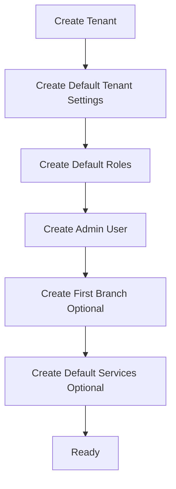

## 37.2 Create Branch Flow

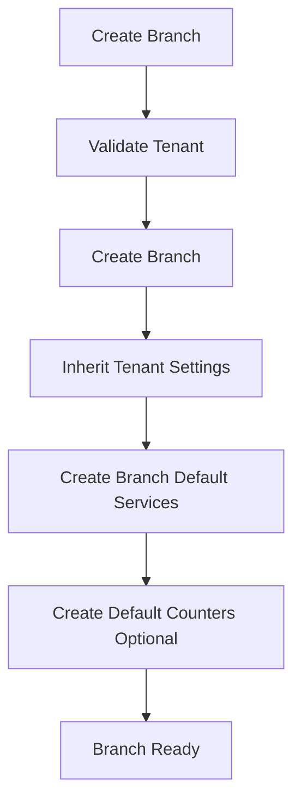

Important:

```text id="r5anbp"
Inherited settings should not be copied unless override is needed.
Effective settings are calculated dynamically.
```

---

# 38. Service and Counter Architecture

## 38.1 Service Scope

Service can be:

```text id="snia31"
Tenant-level template
Branch-level service
```

Tenant-level service example:

```text id="m8xw9h"
Pharmacy
Registration
Cashier
Doctor Consultation
```

Branch-level service example:

```text id="dzg2bp"
Jakarta Branch - Pharmacy
Bandung Branch - Pharmacy
```

Recommended approach:

```text id="952n1e"
Use tenant service templates.
When branch needs to customize, create branch-specific service or branch-service mapping.
```

---

## 38.2 Branch Service Mapping

Recommended table:

```text id="b50g1p"
branch_services
- id
- tenant_id
- branch_id
- service_id
- custom_name nullable
- is_active
- sort_order
- created_at
- updated_at
```

This makes UX easier:

```text id="s4mm8u"
Tenant defines available services.
Branch selects which services are enabled.
Branch may customize display name/order.
```

---

## 38.3 Counter Mapping

```text id="n0jg8t"
counters
- id
- tenant_id
- branch_id
- service_id
- code
- name
- display_name
- status
```

Rules:

```text id="dslkbi"
A counter belongs to one branch.
A counter serves one primary service.
Optional future: counter_service_mappings for multi-service counters.
```

---

# 39. API Flow for Easy UX

## 39.1 Branch Detail UX API

Frontend branch setting page should call one API:

```text id="fh1fzl"
GET /api/v1/branches/{branch_id}/overview
```

Response should include:

```text id="yz8m81"
branch profile
effective settings
enabled services
counters
user access summary
queue config summary
```

This prevents frontend from calling many small APIs just to render one page.

---

## 39.2 Service Configuration UX API

```text id="h43y5v"
GET /api/v1/branches/{branch_id}/services
```

Should return:

```json id="h75pqh"
[
  {
    "service_id": "svc_registration",
    "name": "Registration",
    "enabled": true,
    "is_pharmacy": false,
    "is_pharmacy_reception": false,
    "estimated_duration": {
      "value": 5,
      "source": "tenant"
    },
    "counters": [
      {
        "counter_id": "counter_1",
        "name": "Counter 1",
        "status": "active"
      }
    ]
  }
]
```

---

# 40. Queue API Response Architecture

## 40.1 Create Queue Response

```json id="lrq2qz"
{
  "queue_id": "queue_uuid",
  "ticket_no": "A001",
  "queue_no": 1,
  "queue_date": "2026-06-22",
  "branch": {
    "id": "branch_uuid",
    "name": "Jakarta Branch"
  },
  "current_journey": {
    "id": "journey_uuid",
    "service_id": "service_uuid",
    "service_name": "Registration",
    "counter_id": null,
    "status": "waiting",
    "sequence_no": 1
  }
}
```

## 40.2 Forward Queue Response

```json id="abfljl"
{
  "queue_id": "queue_uuid",
  "ticket_no": "A001",
  "queue_no": 1,
  "previous_journey": {
    "id": "journey_1",
    "service_name": "Registration",
    "status": "forwarded"
  },
  "current_journey": {
    "id": "journey_2",
    "service_name": "Pharmacy",
    "status": "waiting",
    "sequence_no": 2
  },
  "message": "Queue forwarded successfully"
}
```

## 40.3 Visit Journey Response

```json id="nwb9u8"
{
  "queue_id": "queue_uuid",
  "ticket_no": "A001",
  "queue_no": 1,
  "journeys": [
    {
      "sequence_no": 1,
      "service_name": "Registration",
      "status": "forwarded",
      "started_at": "2026-06-22T09:10:00+07:00",
      "completed_at": "2026-06-22T09:20:00+07:00"
    },
    {
      "sequence_no": 2,
      "service_name": "Pharmacy",
      "status": "waiting",
      "started_at": null,
      "completed_at": null
    }
  ]
}
```

---

# 41. Queue List Architecture

Queue list should be journey-based for operation screen.

## 41.1 Counter Screen

Counter/station does not need all queues. It needs active journeys assigned to its service/counter.

```text id="c0gruh"
GET /api/v1/branches/{branch_id}/counters/{counter_id}/queue-journeys
```

Filter:

```text id="o4mpih"
tenant_id
branch_id
counter_id or service_id
journey status in waiting/called/serving/skipped
queue_date
```

---

## 41.2 Service Queue Screen

```text id="s85ecb"
GET /api/v1/branches/{branch_id}/services/{service_id}/queue-journeys
```

Returns current queue for that service, not duplicated queue records.

---

# 42. Dashboard Query Architecture

Dashboard should use `queue_journeys` for operational status.

## 42.1 Tenant Dashboard

```text id="zoo6cl"
Total queues today:
COUNT queues by tenant_id + queue_date

Total active journeys:
COUNT queue_journeys by tenant_id + status active

Total completed visits:
COUNT queues by tenant_id + status completed
```

## 42.2 Branch Dashboard

```text id="f2f6bs"
Waiting by service:
COUNT queue_journeys
WHERE tenant_id = ?
AND branch_id = ?
AND status = waiting
GROUP BY service_id
```

Reason:

```text id="dme6bm"
Queue parent tells how many visits.
Queue journey tells where patients currently are.
```

---

# 43. Repository Architecture Rule

Each repository should require tenant scope.

Bad:

```text id="ylm51k"
FindQueueByID(queueID)
```

Good:

```text id="zc0gbq"
FindQueueByID(ctx, tenantID, branchID, queueID)
```

Bad:

```text id="5vmzsd"
FindBranchByID(branchID)
```

Good:

```text id="xwpgoc"
FindBranchByID(ctx, tenantID, branchID)
```

---

# 44. Service Layer Architecture Rule

Service layer owns business rules.

Repository layer owns database access only.

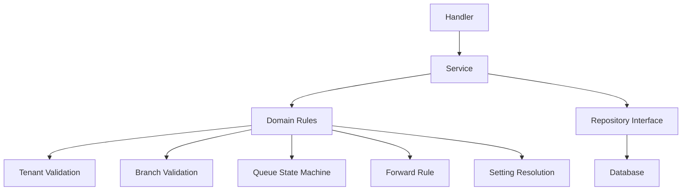

Do not place these in repository:

```text id="l5u3br"
pharmacy rule
forwarding rule
tenant access rule
queue transition rule
setting inheritance rule
```

---

# 45. Transaction Architecture

These operations must be transactional:

```text id="v20ge4"
Create queue
Forward queue
Cancel queue
Complete queue
Create tenant setup
Create branch setup
Bulk update settings
Assign user branch access
```

Forward transaction:

```text id="r79zk7"
BEGIN
  lock queue
  lock active journey
  validate target
  update old journey
  insert new journey
  update queue current_journey_id
  insert visit_journey
COMMIT
```

---

# 46. Multi-Tenant Security Architecture

## 46.1 Request Validation Order

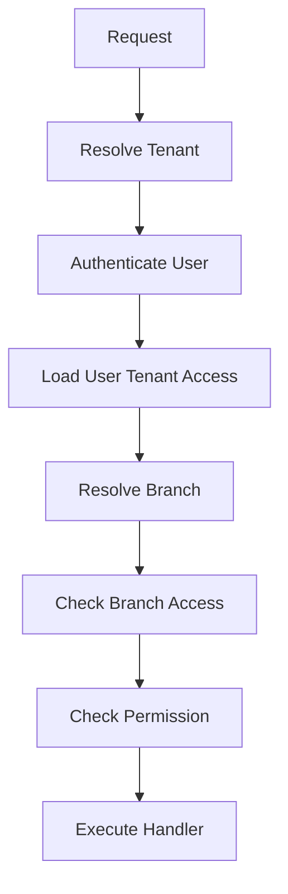

## 46.2 Authorization Must Include

```text id="wne48u"
tenant_id
branch_id
user_id
role_id
permission_key
resource_owner_check
```

Example permission:

```text id="l9mqm7"
queue.forward
queue.call
queue.complete
branch.settings.update
tenant.settings.update
```

---

# 47. Recommended Permission Model

```text id="g6oile"
tenant.read
tenant.update

branch.create
branch.read
branch.update
branch.delete

branch.settings.read
branch.settings.update

service.create
service.read
service.update
service.delete

counter.create
counter.read
counter.update
counter.delete

queue.create
queue.read
queue.call
queue.start
queue.forward
queue.complete
queue.cancel
queue.skip

visit_journey.read

user.create
user.read
user.update
user.delete

role.create
role.read
role.update
role.delete
```

Permission should be action-based, not route-string-based only.

---

# 48. Suggested Starter Module Contract

Each module should expose:

```text id="4oqo5h"
Module
- RegisterRoutes(router)
- RegisterDependencies(container)
- Migrate(db) optional
```

Example module boundaries:

```text id="tlfr94"
TenantModule
BranchModule
SettingModule
ServiceModule
CounterModule
QueueModule
VisitJourneyModule
AccessModule
```

QueueModule depends on:

```text id="z7rnau"
SettingModule
BranchModule
ServiceModule
CounterModule
VisitJourneyModule
TransactionManager
```

---

# 49. Architecture-Level Migration From Old Design

## 49.1 Old Concept to New Concept

| Old Concept              | New Concept                            |
| ------------------------ | -------------------------------------- |
| Company                  | Tenant                                 |
| Branch                   | Branch under tenant                    |
| Menu/Submenu             | Service                                |
| Locket                   | Counter                                |
| Customer queue record    | Queue parent                           |
| Forward creates customer | Forward creates queue journey          |
| Customer history         | Visit journey                          |
| Queue number per record  | Queue number per visit                 |
| Global config            | Tenant/branch/service/counter settings |

---

## 49.2 Migration Strategy

```text id="3e46tg"
1. Create tenants from old companies.
2. Attach branches to tenants.
3. Convert menus into services.
4. Convert lockets into counters.
5. Convert existing customer queue records into queues.
6. Detect forwarded records using old_id or relation.
7. Merge related forwarded records into one queue.
8. Convert old forwarded rows into queue_journeys.
9. Preserve old ticket/queue number from first queue record.
10. Generate visit_journeys from journey history.
```

Important migration rule:

```text id="7zsedz"
When multiple old records represent one forwarded visit, only the first record becomes queues.
All following records become queue_journeys.
```

---

# 50. Final Architecture Acceptance Criteria

The architecture is accepted only if all rules are true:

```text id="qbmabm"
Every business table has tenant_id.
Every branch-owned table has branch_id.
Branch always belongs to tenant.
Forwarding does not create queues record.
Forwarding creates queue_journeys.
Queue ticket does not change during forwarding.
Queue number does not change during forwarding.
Only one active journey exists per queue.
Settings support inheritance.
Effective settings are easy for frontend UX.
Visit journey is internal history only.
External integrations are excluded from core architecture.
```

---

# 51. Final Recommended Architecture Summary

```text id="7rt5xq"
The rebuilt QMS should be a tenant-first, branch-aware queue platform.

Tenant owns the system boundary.
Branch owns operational context.
Queue owns ticket identity.
Queue Journey owns movement and service steps.
Visit Journey owns readable history.
Settings owns UX-friendly configuration inheritance.
```

The most important normalized design decision:

```text id="k6qrnf"
Do not create a new queue when forwarding.
Create a new queue_journey under the same queue.
```

This solves the main old-flow problem:

```text id="peo8yv"
No multiple tickets.
No multiple queue numbers.
No duplicate queue records.
No messy forward history.
No cross-tenant leakage.
No hard-to-understand configuration flow.
```
