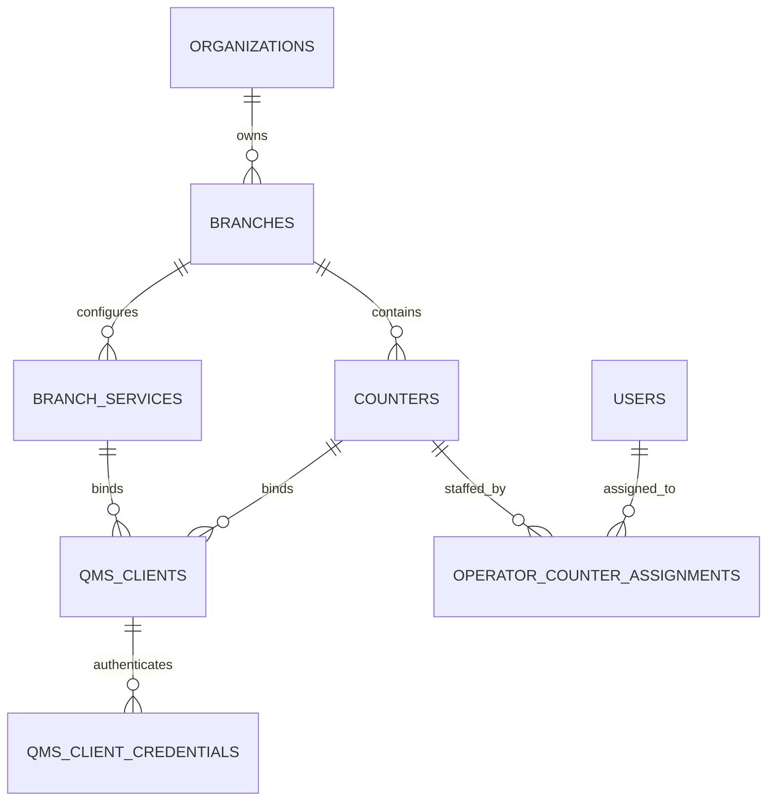
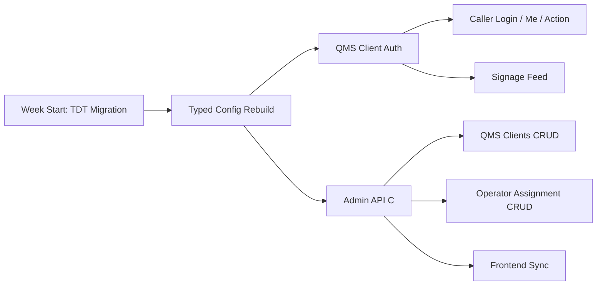
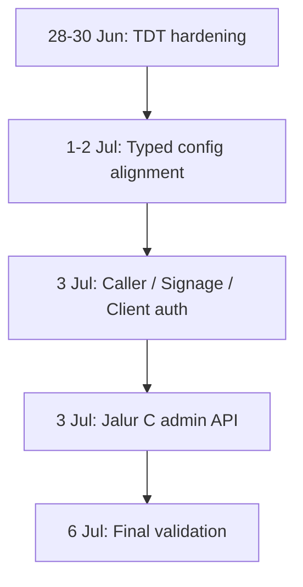

# Weekly Progress: 28 Juni 2026 - 6 Juli 2026

Dokumen ini merangkum progres project berdasarkan `git history lokal di laptop ini` untuk periode `28 Juni 2026` sampai `6 Juli 2026`.

Metode analisis:

- Sumber data diambil dari repository lokal: `/home/user/Documents/Riset/queue-base`
- Commit yang dianalisis adalah commit non-merge dan merge yang relevan dengan QMS rebuild
- Fokus laporan minggu ini berada pada area `testing hardening`, `typed config rebuild`, `qms client auth`, `frontend dashboard sync`, dan `admin api layer`
- Commit ditata berdasarkan tema runtime agar progress lebih mudah dibaca

## Ringkasan Mingguan

Fokus progres minggu ini bergerak dari penguatan test suite ke finalisasi fondasi runtime QMS MVP.

Tema utamanya adalah:

1. merapikan test suite QMS dan core access system ke table-driven pattern,
2. menuntaskan typed configuration rebuild dan menghapus generic settings core path,
3. mengunci caller/signage/client auth flow dengan binding tenant, branch, dan client,
4. menambahkan admin API lanjutan untuk qms clients dan operator-counter assignments,
5. menyelaraskan frontend dashboard, API types, dan form admin QMS,
6. menutup gap dokumentasi dan audit coverage untuk fase typed-config dan jalur C.

## Commit yang Dianalisis

| Tanggal | Commit | Pesan |
| --- | --- | --- |
| 28 Juni 2026 | `45819f3` | `test(scanner): migrate scanner controller tests to table-driven pattern` |
| 28 Juni 2026 | `b10d8d7` | `test(scanner): migrate scanner module and usecase tests to table-driven pattern` |
| 28 Juni 2026 | `cd55c40` | `test(queue): migrate queue module, repository, and controller tests to table-driven pattern` |
| 28 Juni 2026 | `a786ab0` | `test(qms): fix trailing flat tests in permission and counter modules` |
| 28 Juni 2026 | `b01a8b0` | `docs(tdt): finalize completion report after full QMS migration` |
| 28 Juni 2026 | `05c1748` | `test(tdt): convert permission and access tests` |
| 28 Juni 2026 | `0dc1c8a` | `docs(tdt): add roadmap for user and auth TDT migration` |
| 28 Juni 2026 | `bee8e1c` | `test(tdt): convert role controller tests` |
| 28 Juni 2026 | `8ad8725` | `test(tdt): convert permission usecase tests` |
| 28 Juni 2026 | `29bf617` | `test(tdt): convert permission guardian tests` |
| 28 Juni 2026 | `8b91522` | `test(tdt): convert access repository tests` |
| 28 Juni 2026 | `70fe766` | `test(tdt): convert access endpoint repository tests` |
| 28 Juni 2026 | `f8dbbb0` | `test(tdt): convert permission and role security tests` |
| 28 Juni 2026 | `b59621f` | `test(tdt): convert permission and role guardian edge tests` |
| 28 Juni 2026 | `c8c5f27` | `test(tdt): convert permission concurrent tests` |
| 28 Juni 2026 | `20389d7` | `test(tdt): convert role access permission integration tests` |
| 28 Juni 2026 | `2db2f6b` | `test(tdt): convert permission and role integration scenarios` |
| 28 Juni 2026 | `a4f611e` | `test(tdt): convert role access permission e2e api tests` |
| 28 Juni 2026 | `864b95d` | `test(tdt): convert role integration update test` |
| 28 Juni 2026 | `eab563f` | `test(tdt): fix acces e2e test` |
| 28 Juni 2026 | `d65294d` | `test(tdt): convert auth and user module tests` |
| 28 Juni 2026 | `29b4d2b` | `test(tdt): convert user and auth repository tests to TDT` |
| 28 Juni 2026 | `ab5acde` | `docs: add auth usecase groups and update lessons` |
| 28 Juni 2026 | `66b9d81` | `docs(tdt): update migration progress report` |
| 28 Juni 2026 | `ff73680` | `test(tdt): convert remaining user and auth tests to TDT` |
| 28 Juni 2026 | `070623d` | `test(e2e): add monolith for endpoint registration` |
| 28 Juni 2026 | `f06dfc5` | `test(user): fix linter error` |
| 29 Juni 2026 | `7792a5d` | `chore: delete unused comment` |
| 29 Juni 2026 | `07787b6` | `fix branch schema mismatch` |
| 29 Juni 2026 | `a353fd4` | `feat(qms):add logger in branch module` |
| 29 Juni 2026 | `684e820` | `feat: add logger in queue module` |
| 29 Juni 2026 | `cdd35a9` | `chore: update description access always return to response` |
| 29 Juni 2026 | `e42026b` | `docs(qms): add manual testing runbook` |
| 29 Juni 2026 | `c8bc2b2` | `test:fix integration queue testing` |
| 29 Juni 2026 | `aae17a9` | `chore(docs): add qms architecture documentation` |
| 29 Juni 2026 | `95f214f` | `chore: update get code context.sh` |
| 30 Juni 2026 | `b6b55d3` | `Merge branch 'dev' of https://github.com/Roisfaozi/queue-base into test/table-testing` |
| 30 Juni 2026 | `a00bf82` | `test:fix log module testing` |
| 30 Juni 2026 | `96ae5cf` | `fix: test integration importing logger` |
| 30 Juni 2026 | `e6c49e6` | `test: migrate api_key integration to TDT and fix missing category field for access, auth, role` |
| 30 Juni 2026 | `50b78f4` | `test: migrate organization integration to TDT` |
| 30 Juni 2026 | `d3b50d3` | `test: migrate api key, org, and data isolation tests to TDT format` |
| 30 Juni 2026 | `8f3037d` | `test: migrate user_lifecycle_test.go to TDT format` |
| 30 Juni 2026 | `981ade0` | `test: migrate user_e2e and auth_e2e to TDT format` |
| 1 Juli 2026 | `974221b` | `test: migrate organization controller and usecase tests to TDT format` |
| 1 Juli 2026 | `d23a8b8` | `test: migrate tenant_isolation_e2e_test.go to TDT format` |
| 1 Juli 2026 | `c5ecc53` | `test: format and commit api_key_controller_test.go` |
| 1 Juli 2026 | `fa12707` | `test: migrate audit controller unit test to TDT format` |
| 1 Juli 2026 | `b759083` | `test: migrate audit usecase unit test to TDT format` |
| 1 Juli 2026 | `d453952` | `test: migrate role usecase unit test to TDT format` |
| 1 Juli 2026 | `4ad7d7f` | `fix(dev): harden worktree env isolation and branch reuse` |
| 1 Juli 2026 | `ba2c5d5` | `sync fronent with vite config` |
| 1 Juli 2026 | `4dbc88a` | `test: migrate permission security tests to TDT format` |
| 1 Juli 2026 | `098c0b1` | `fix(dev): harden worktree env isolation and branch reuse` |
| 1 Juli 2026 | `ccf5204` | `fix users provider wiring` |
| 1 Juli 2026 | `ad616b3` | `feat(dev): add frontend worktree env sync and DX commands` |
| 1 Juli 2026 | `3a91adb` | `test: migrate admin security and api key lifecycle tests to TDT format` |
| 1 Juli 2026 | `61de128` | `fix web api error handling` |
| 1 Juli 2026 | `bb6cbde` | `fix queue select empty values` |
| 1 Juli 2026 | `26273b0` | `test: migrate remaining integration and scenario tests to TDT format` |
| 1 Juli 2026 | `777b00a` | `test: fix undefined AuditRepository type in audit_repository_test.go` |
| 1 Juli 2026 | `7da3f90` | `test: migrate audit_usecase_test.go to unified TDT format` |
| 1 Juli 2026 | `ee4a0cc` | `test: migrate audit_controller_test.go to unified TDT format` |
| 1 Juli 2026 | `fe8be03` | `fix(scanner): preserve auth error contracts` |
| 1 Juli 2026 | `b1d681e` | `chore(dev): harden worktree DX flow` |
| 1 Juli 2026 | `a1fb630` | `test: migrate export_audit_e2e_test.go to unified TDT format` |
| 1 Juli 2026 | `3c8bab7` | `test: migrate audit_handler_test.go to TDT format` |
| 1 Juli 2026 | `6935b1a` | `chore(ai): add new table driven testing ai workflow` |
| 1 Juli 2026 | `ab74fc4` | `test: migrate remaining audit worker tests to TDT format` |
| 1 Juli 2026 | `7d3216b` | `fix(organization): add logging for update member attempts and handle non-member cases` |
| 1 Juli 2026 | `ff1bf85` | `test: migrate stats integration test to TDT format` |
| 1 Juli 2026 | `cc2d85e` | `test: resolve merge conflict and migrate tus_integration_test to TDT format` |
| 2 Juli 2026 | `4c22d59` | `Merge pull request #2 from Roisfaozi/test/table-testing` |
| 2 Juli 2026 | `4707d1f` | `commit wen json` |
| 2 Juli 2026 | `f1adb91` | `Merge branch 'dev' of https://github.com/Roisfaozi/queue-base into dev` |
| 2 Juli 2026 | `45599a3` | `docs(agent): require plan and progress updates` |
| 2 Juli 2026 | `d30a2bc` | `test: migrate password_recovery_test to TDT format` |
| 2 Juli 2026 | `39fbdcf` | `chore: save wip state` |
| 2 Juli 2026 | `f9780d4` | `fix(qms): harden tenant-branch queue scoping` |
| 2 Juli 2026 | `d5c8635` | `test: migrate realtime_test.go to TDT format` |
| 2 Juli 2026 | `4b8cc03` | `test: migrate adv_rate_limit_test.go to TDT format` |
| 2 Juli 2026 | `a5edc5a` | `test: migrate rbac_orchestration_test.go to TDT format` |
| 2 Juli 2026 | `3ae7dfb` | `test: migrate rate_limit_integration_test.go to TDT format` |
| 2 Juli 2026 | `17ae9b3` | `chore: add .qwen/.gitignore` |
| 2 Juli 2026 | `534b5f2` | `test: migrate queue_controller_test.go to TDT format` |
| 2 Juli 2026 | `e0725d2` | `fix(organization): ensure org code exists in join fixtures` |
| 2 Juli 2026 | `2ca9e05` | `docs: update typed config progress` |
| 2 Juli 2026 | `2e83f8c` | `feat(qms): add branch service typed config support` |
| 2 Juli 2026 | `b29d47e` | `feat(qms): add branch service queue settings support` |
| 2 Juli 2026 | `f8ab86d` | `feat(qms): add queue settings resolver from branch service` |
| 2 Juli 2026 | `f248f88` | `docs(qms): update progress report with branch service settings` |
| 2 Juli 2026 | `bf33352` | `qms: align typed config schema` |
| 2 Juli 2026 | `90c5029` | `qms: rebase queue config resolver` |
| 2 Juli 2026 | `78b4d42` | `qms: add caller action endpoint` |
| 2 Juli 2026 | `decf8bb` | `docs: record qms typed config progress` |
| 2 Juli 2026 | `942b90c` | `docs: record signage api phase` |
| 2 Juli 2026 | `3de19be` | `qms: add signage api skeleton` |
| 3 Juli 2026 | `5b25ec5` | `qms: add client credential authenticator` |
| 3 Juli 2026 | `f5f094c` | `qms: wire client auth into caller signage` |
| 3 Juli 2026 | `8673493` | `docs: record qms client auth phase` |
| 3 Juli 2026 | `b72418b` | `qms: add client binding columns` |
| 3 Juli 2026 | `1950414` | `qms: implement signage feed queries` |
| 3 Juli 2026 | `add3d6a` | `qms: enforce caller context bindings` |
| 3 Juli 2026 | `b058151` | `test: add caller usecase tests` |
| 3 Juli 2026 | `181b0eb` | `test: table-drive qms caller and signage coverage` |
| 3 Juli 2026 | `86bf8d2` | `qms: enforce client credential expiry` |
| 3 Juli 2026 | `5e91f9c` | `docs: record qms test coverage fixes` |
| 3 Juli 2026 | `a9e2589` | `qms: add caller login me endpoints` |
| 3 Juli 2026 | `c5bb37b` | `docs: record caller login me phases and lessons` |
| 3 Juli 2026 | `bcf761b` | `signage: fallback branding to tenant` |
| 3 Juli 2026 | `6ea4eea` | `docs: add guidelines for efficient coding practices` |
| 3 Juli 2026 | `e762697` | `qms: add service audio narrative columns` |
| 3 Juli 2026 | `f3488bd` | `docs: record service audio narrative schema phase` |
| 3 Juli 2026 | `fd34383` | `qms: add allow_recall skip cancel guards to queue transition` |
| 3 Juli 2026 | `0c2b957` | `qms: add auto-call-next after queue complete` |
| 3 Juli 2026 | `bd6ed97` | `qms: include request id in client auth logs` |
| 3 Juli 2026 | `8730f8b` | `docs: summarize qms typed config rebuild completion` |
| 3 Juli 2026 | `b8caf29` | `qms: wire auto_call_next typed schema entity resolver and effective config` |
| 3 Juli 2026 | `44e9b1b` | `qms: remove generic settings module and settings table` |
| 3 Juli 2026 | `9fa8410` | `qms: add qms client admin create endpoints` |
| 3 Juli 2026 | `2efe877` | `docs: rebase qms typed-config coverage` |
| 3 Juli 2026 | `ff278c1` | `sync qms frontend contracts` |
| 3 Juli 2026 | `f97e056` | `remove stale generic settings table UI` |
| 3 Juli 2026 | `2f8eb8d` | `add qms client api helpers` |
| 3 Juli 2026 | `df23ebc` | `drop stale qms setting type` |
| 3 Juli 2026 | `e56e4ec` | `support optional counter on queue forward` |
| 3 Juli 2026 | `86b205d` | `fix queue forward counter selection` |
| 3 Juli 2026 | `78f8acf` | `fix queue detail journey timestamps` |
| 3 Juli 2026 | `a6f1492` | `refactor: simplify settings module usage in QMS integration tests` |
| 3 Juli 2026 | `cc61bb7` | `fix stale counter filter on branch switch` |
| 3 Juli 2026 | `834ac57` | `add qms client admin setup form` |
| 3 Juli 2026 | `9728f63` | `add caller and signage admin surfaces` |
| 3 Juli 2026 | `0b33ffe` | `sync client qms api headers` |
| 3 Juli 2026 | `8476e40` | `fix: map require_counter_for_service and require_counter in QueueSettingsResolver` |
| 3 Juli 2026 | `adb30de` | `refactor: suppress unused variable and comment out POST request in TestQMSQueueE2E_LifecycleAndScannerGuard` |
| 3 Juli 2026 | `7474891` | `refactor: remove unused settings model import and commented-out configuration payload in TestQMSQueueE2E_LifecycleAndScannerGuard` |
| 3 Juli 2026 | `5c559f2` | `feat: add integration test file for QMS client module` |
| 3 Juli 2026 | `5cc79dc` | `qms: add operator assignment admin api` |
| 3 Juli 2026 | `26687cb` | `qms: extend qms client admin api and wire module` |
| 3 Juli 2026 | `454434f` | `docs: record jalur c admin api slice` |
| 3 Juli 2026 | `5792ce2` | `test: add edge vulnerability tests for qms client and operator assignment` |
| 6 Juli 2026 | `e150cc8` | `fix: validate qms client type in admin usecase` |

## Ringkasan Tema Implementasi

### 1. Testing Hardening dan TDT Migration Massal

Fase awal minggu ini didominasi migrasi test suite ke table-driven pattern.

Yang selesai:

- scanner controller, module, dan usecase tests,
- queue module, repository, dan controller tests,
- permission, access, role, auth, user, api key, organization, audit, stats, realtime, tus, dan rate-limit test suites,
- e2e endpoint registration monolith,
- hardening kasus concurrency, integration, edge, dan vulnerability.

Dampaknya: test suite QMS dan access system lebih konsisten, lebih mudah dibaca, dan lebih tahan terhadap regresi.

### 2. Typed Config Rebuild Dituntaskan

Minggu ini menjadi titik final typed configuration rebuild.

Yang selesai:

- schema typed config di-align,
- queue config resolver direbase,
- branch service typed config ditambahkan,
- `auto_call_next` masuk ke schema, entity, resolver, dan effective config,
- generic settings module dan settings table dihapus dari core QMS path,
- stale UI generic settings dibersihkan,
- docs dan progress tracker disinkronkan.

Dampaknya: runtime QMS sekarang jalan di typed-config hierarchy, bukan generic fallback lama.

### 3. Caller, Signage, dan Client Auth MVP

Fase 3 Juli mengunci flow device-authenticated untuk caller dan signage.

Yang selesai:

- client credential authenticator,
- binding client ke tenant / branch / counter,
- caller login dan me endpoints,
- signage feed queries (`/me`, `/current-calls`, `/queues`),
- enforcement credential expiry,
- request-id logging,
- fallback branding ke tenant,
- audio/narrative columns untuk service,
- queue transition guards (`allow_recall`, `skip`, `cancel`, `auto_call_next`).

Dampaknya: device client tidak bisa lagi lintas tenant sembarang, dan caller/signage flow lebih aman.

### 4. Admin API Jalur C Dibuka

Jalur admin lanjutan dituntaskan untuk kebutuhan panel operasional.

#### QMS Client Admin

- `POST /api/v1/qms-clients`
- `POST /api/v1/qms-clients/credentials`
- `GET /api/v1/qms-clients`
- `GET /api/v1/qms-clients/{id}`
- `PATCH /api/v1/qms-clients/{id}`
- `DELETE /api/v1/qms-clients/{id}` sebagai soft deactivate

Scope minimal yang tercapai:

- list device/client,
- update `name`, `is_active`, `branch_service_id`, `counter_id`,
- deactivate client tanpa hard delete,
- rotate credential tanpa membocorkan secret hash.

#### Operator Assignment Admin

- `POST /api/v1/operator-counter-assignments`
- `GET /api/v1/operator-counter-assignments`
- `DELETE /api/v1/operator-counter-assignments/{id}` sebagai unassign

Fungsi yang tertutup:

- assign operator ke counter,
- list assignment untuk kebutuhan UI/admin,
- unassign lewat `unassigned_at`,
- caller login tidak lagi bergantung pada seed manual DB.

### 5. Frontend Sync dan DX

Frontend dashboard ikut diselaraskan.

Yang selesai:

- sync API contracts,
- add qms client api helpers,
- add qms client admin setup form,
- add caller and signage admin surfaces,
- remove stale generic settings UI,
- sinkronisasi frontend worktree env dan vite config,
- perbaikan wiring provider dan API error handling.

Dampaknya: dashboard lebih dekat ke contract runtime baru, bukan lagi asumsi lama.

### 6. Dokumentasi dan Audit Coverage

Dokumentasi dan lessons ikut dibersihkan dan ditambah.

Yang selesai:

- progress report TDT,
- roadmap migrasi user/auth,
- manual testing runbook QMS,
- architecture documentation QMS,
- typed-config progress notes,
- typed-config coverage audit,
- record phase docs untuk caller, signage, service audio narrative, dan jalur C admin API.

## Diagram Mingguan

### A. Entity/Binding Diagram

### B. Flow Diagram

### C. Weekly Phase Map

## Dampak dan Next Step

- **Dampak:** QMS rebuild masuk fase stabil: typed-config hidup, client auth hidup, caller/signage jalan, admin API layer C mulai lengkap, dan test coverage lebih rapi.
- **Next Step:** tutup integration/E2E untuk admin API C, cek frontend proxy/type sync akhir, lalu commit per kategori file kalau masih ada perubahan tertinggal.
