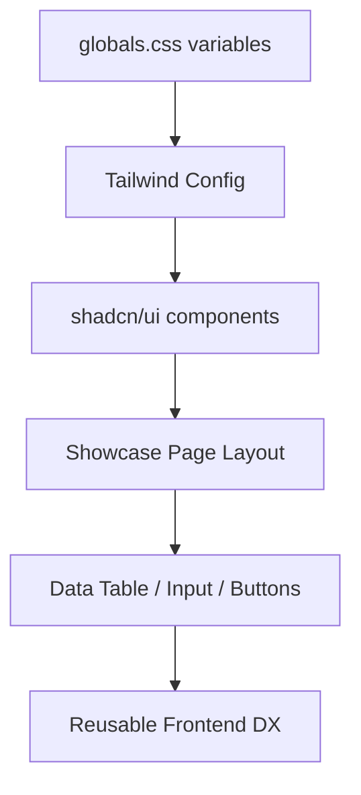
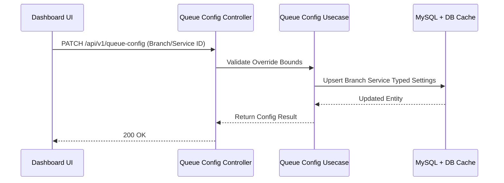
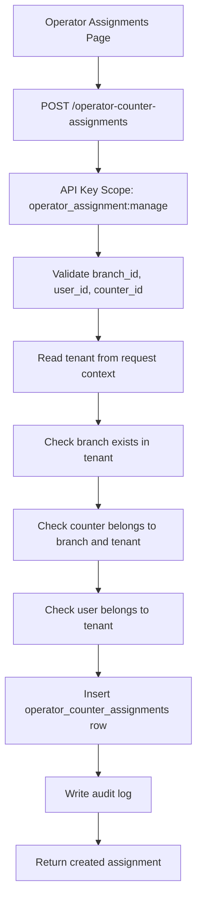
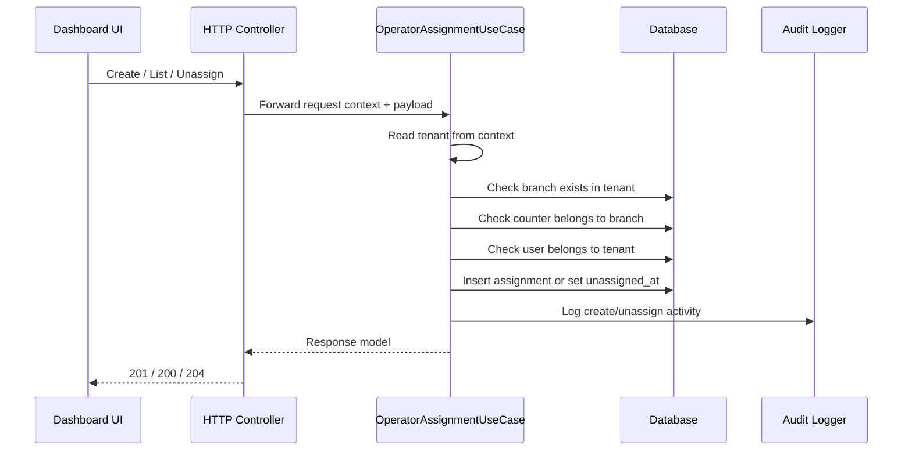

# Weekly Progress: 6 Juli 2026 - 12 Juli 2026

Dokumen ini merangkum progres project berdasarkan `git history lokal di laptop ini` untuk periode `6 Juli 2026` sampai `12 Juli 2026`.

Metode analisis:

- Sumber data diambil dari repository lokal: `/home/user/Documents/Riset/queue-base`
- Commit yang dianalisis adalah commit non-merge dan merge yang relevan dengan QMS rebuild dan frontend sync.
- Fokus laporan minggu ini berada pada area `typed config rebuild`, `frontend UI showcase`, `queue_config typed patch`, `API documentation`, dan `testing hardening`.
- Commit ditata berdasarkan tema runtime agar progress lebih mudah dibaca.

## Ringkasan Mingguan

Fokus progres minggu ini bergerak dari pematangan typed-config QMS ke penguatan frontend surface dan penyelarasan dokumentasi API.

Tema utamanya adalah:

1. menutup migrasi generic settings ke typed queue_config,
2. menyelaraskan frontend dashboard, operator assignments, dan queue-config override,
3. menstabilkan E2E dan integration tests setelah perubahan kontrak runtime,
4. memperkaya documentation API core dan QMS,
5. menyiapkan foundation visual/frontend lewat showcase dan component variants.

## Commit yang Dianalisis

| Tanggal | Commit | Pesan |
| --- | --- | --- |
| 10 Juli 2026 | `f329727` | `docs(api): align request examples with full field contracts` |
| 10 Juli 2026 | `fa1bd7b` | `docs(api): add request examples and curl for all core and qms endpoints` |
| 10 Juli 2026 | `88e4b9b` | `docs(api): add full field detail for core and qms references` |
| 9 Juli 2026 | `25af8a8` | `docs(api): add full non-qms API references` |
| 9 Juli 2026 | `9207e6f` | `docs(api): add complete qms response examples` |
| 8 Juli 2026 | `05397ab` | `feat: document batch sed edit issues and queue_config unit tests` |
| 8 Juli 2026 | `ace8b37` | `feat(web): add operator assignments page, sidebar nav, and wizard step` |
| 8 Juli 2026 | `1f43364` | `test(qms): add queue_config repository and usecase unit tests` |
| 8 Juli 2026 | `c299598` | `fix(qms): update integration tests to use queue_config instead of settings` |
| 8 Juli 2026 | `cee3dc6` | `feat(web): add queue-config override dialog with typed config patch` |
| 8 Juli 2026 | `14f4392` | `feat(web): add queue-config patch and reset api helpers` |
| 8 Juli 2026 | `10739e9` | `feat(qms): add typed queue config patch routes` |
| 8 Juli 2026 | `065f107` | `docs(qms): align specs and task notes with new queue-config surface` |
| 8 Juli 2026 | `955bc76` | `refactor(qms): rename queue config reset routes` |
| 7 Juli 2026 | `b0cffef` | `feat(web): Add categorized layout for component showcase ...` |
| 7 Juli 2026 | `edafb3c` | `feat(web): enhance UI component showcase with new structure and visual variants` |
| 7 Juli 2026 | `6e828ba` | `feat(web): add robust table layout and dynamic pagination to data display components` |
| 7 Juli 2026 | `b490403` | `feat(web): enhance input and button variants` |
| 7 Juli 2026 | `0f2a4de` | `feat(web): enhance component previews for queue management` |
| 7 Juli 2026 | `92dd17a` | `feat(web): enhance component previews with additional variants` |
| 7 Juli 2026 | `f4cc925` | `fix(css): add padding variables for input and button components` |
| 7 Juli 2026 | `8ab4e89` | `feat(web): add categorized dashboard showcase` |
| 7 Juli 2026 | `12d4a96` | `fix(web/ui): explicitly type font-size arbitrary values` |
| 7 Juli 2026 | `ec40ef5` | `fix(db): resolve migration constraints and syntax errors` |
| 7 Juli 2026 | `3740628` | `test: fix qms e2e branch service setup` |
| 7 Juli 2026 | `5f59ffa` | `docs: add qms final audit parity report` |
| 7 Juli 2026 | `ce4dce4` | `docs: rebase qms typed config coverage` |
| 7 Juli 2026 | `2f42d9a` | `test: bind caller signage lifecycle queue to counter` |
| 7 Juli 2026 | `cf732b8` | `test: fix qms integration setup path and mock tests` |
| 7 Juli 2026 | `8ce7ce8` | `test: fix qms operator assignment and audit e2e setup` |
| 7 Juli 2026 | `11d915e` | `fix: update branch activation guard to support tenant logo fallback` |
| 7 Juli 2026 | `8e6f1f8` | `docs: record journey lifecycle test coverage` |
| 7 Juli 2026 | `b536bb5` | `feat: add journey lifecycle integration tests and fix E2E compile issues` |
| 7 Juli 2026 | `be48e6f` | `fix: e2e compile after typed config removal` |
| 7 Juli 2026 | `c46431e` | `test: add caller and signage integration lifecycle` |
| 7 Juli 2026 | `10a32b9` | `test: cover full queue journey lifecycle` |
| 7 Juli 2026 | `7bb78fe` | `qms: allow branch activation with tenant logo fallback` |
| 7 Juli 2026 | `47cd57d` | `qms: add queue setting reset inheritance api` |

## Ringkasan Tema Implementasi

### 1. API Documentation Alignment

Minggu ini ditutup dengan penyelarasan API contracts di `documentation/api/*` agar sesuai dengan codebase `qms_mvp_alignment`.

Yang selesai:
- Menambahkan complete response data shape untuk API QMS.
- Memasukkan request payload (JSON bodies), query params, dan CURL usage example yang lengkap sesuai real entity tables.
- Mengaudit dan menyelaraskan non-QMS API: `AUTH`, `USER`, `ROLE_PERMISSION`, `ORG_PROJECT`, `INTEGRATIONS`.

Dampaknya: API reference lebih akurat, meminimalkan miskonsepsi payload dan tipe data di level frontend maupun integrasi luar.

### 2. Frontend UI Showcase & Design System

Layer frontend mendapatkan ekspansi pada foundation design-system melalui branch `feat/new-design`.

Yang selesai:
- Penambahan halaman dashboard component showcase terstruktur di `/dashboard/showcase`.
- Ekstensi variants untuk `button`, `input`, `table`, dan perbaikan arbitrary typed `font-size` TailwindCSS.
- Update CSS variables layer untuk memfasilitasi tema Next.js frontend.

Dampaknya: development UI ke depan memiliki sumber kebenaran komponen yang terpusat dan konsisten secara visual.

### 3. Queue Config Pipeline Completion

Rangkaian migrasi `generic settings` menjadi `typed queue_config` diselesaikan sampai layer UI dashboard.

Yang selesai:
- Typed QMS patch dan reset API layer masuk di `internal/modules/queue_config/`.
- Frontend api helper `qms.ts` disesuaikan untuk queue-config override form.
- Queue-config override dialog pada dashboard client (`apps/web`).
- Unit test dan mock layer untuk repository + usecase typed queue config.

Dampaknya: administrator QMS dapat mengonfigurasi limit dan behavior antrean di UI dengan constraint data yang solid di backend.

### 4. Hardening Migration, Integration & E2E Tests

Efek domino migrasi typed_config dan skema database, terutama `000033_qms_mvp_alignment`, diselesaikan.

Yang selesai:
- Perbaikan syntax error pada index composite dan foreign key saat migration `000033`.
- Mock setup dan package import fix untuk test suite e2e + integration pasca generic settings dihapus.
- Test coverage untuk siklus lifecycle caller/signage, journey state, branch activation logo fallback, dan reset config inheritance.

## Diagram Mingguan

### A. Component Design System Flow (Frontend)

### B. Typed Config Pipeline Override

### C. Operator Assignment Flow

### D. Operator Assignment Logic

## Dampak dan Next Step

- **Dampak:** QMS kini terintegrasi dengan konfigurasi berbasis strong-typing. Dokumentasi API merepresentasikan kontrak runtime terbaru, migrasi DB lebih aman, dan frontend punya foundation UI yang rapi.
- **Next Step:** lakukan smoke test untuk UI frontend dan validasi operasional realtime API. Sinkronisasi lebih lanjut antara operator board di Web Client dengan SSE payload.
