# Architecture Visual And Sequence Guide

Dokumen ini merangkum arsitektur visual project serta sequence diagram untuk flow bisnis inti:

- `register`
- `login`
- `invite member`
- `assign role`

Dokumen ini melengkapi [ARCHITECTURE.md](./ARCHITECTURE.md) dengan fokus pada:

- peta layer runtime
- hubungan antarkomponen
- flow request end-to-end
- titik transaksi, policy, audit, dan background task

## 1. System Context

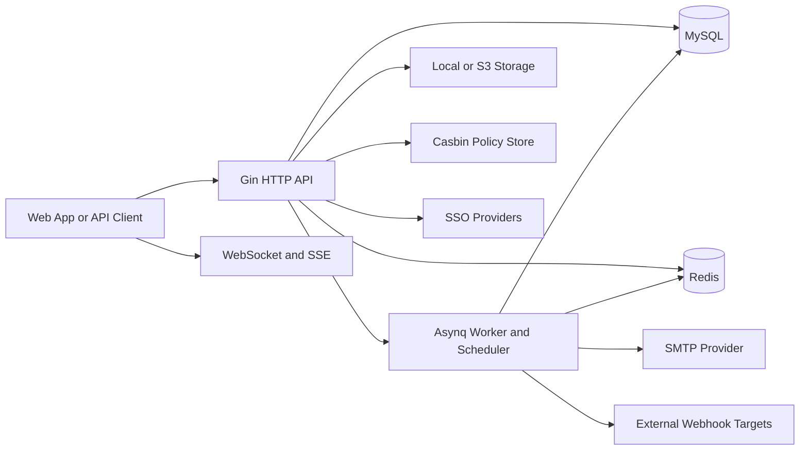

## 2. Runtime Composition

Semua shared dependency dan module wiring dibuat di `internal/config/app.go`.

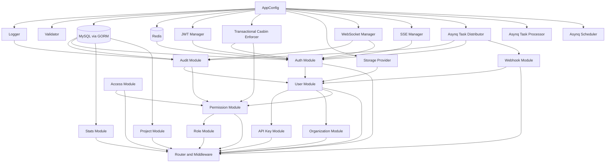

## 3. Layered Architecture

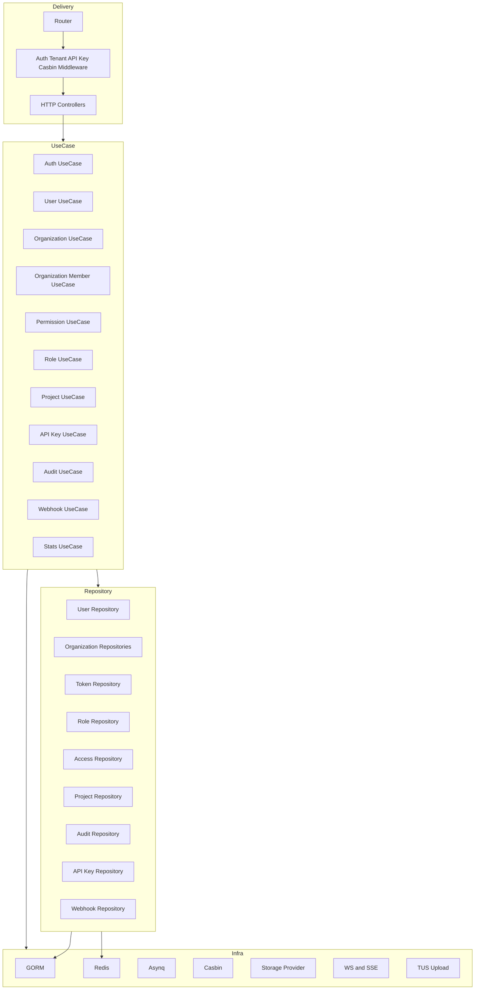

## 4. Access Segmentation

Router membagi akses ke empat zona utama:

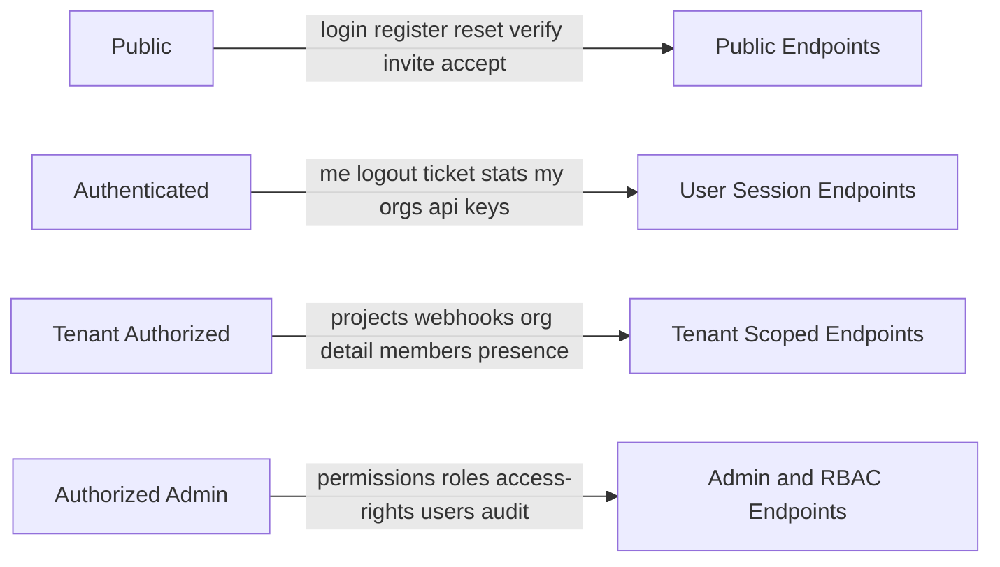

## 5. Request Pipeline

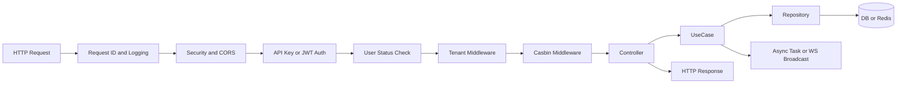

## 6. Sequence Diagram: Register

Register di sistem ini tidak hanya membuat user, tetapi juga auto-provision workspace default dan auto-login.

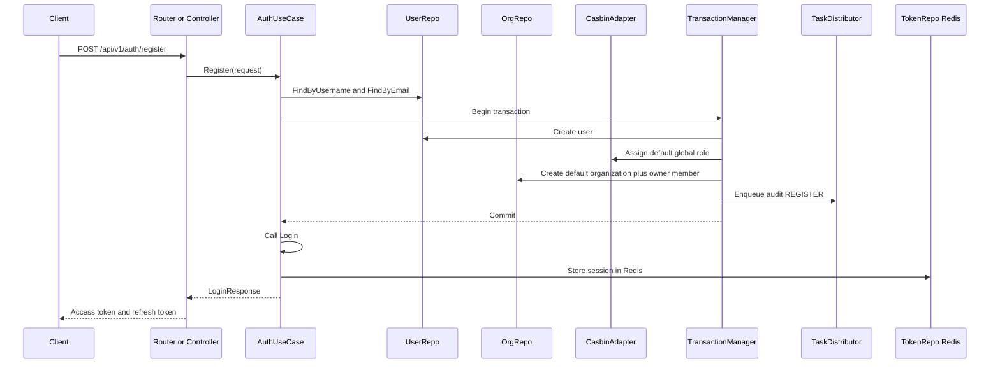

### Register business notes

- user baru langsung punya workspace default
- global role default dipasang saat onboarding
- audit `REGISTER` dikirim sebagai async task
- hasil akhirnya bukan sekadar `201 created`, tetapi sesi login aktif

## 7. Sequence Diagram: Login

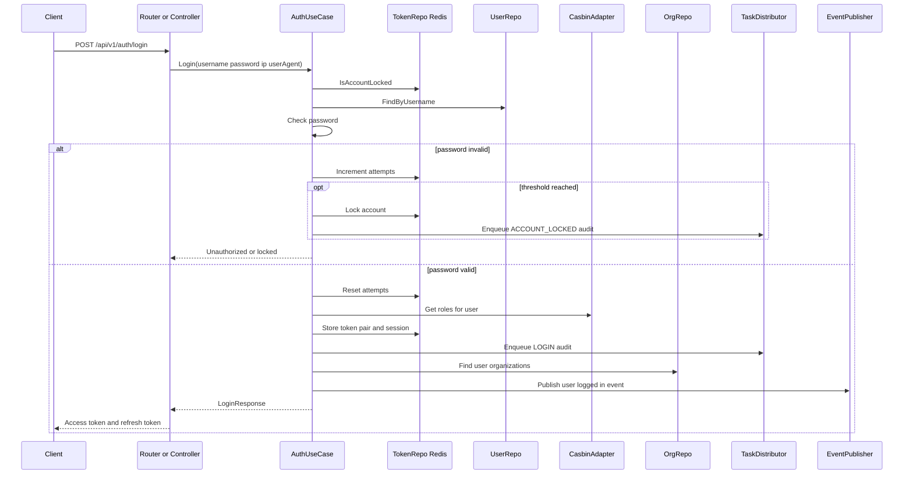

### Login business notes

- session disimpan di Redis, jadi logout dan revoke bisa benar-benar efektif
- login punya lockout policy
- user status `suspended` atau `banned` akan memblokir login
- login juga jadi event realtime ke organisasi yang relevan

## 8. Sequence Diagram: Invite Member

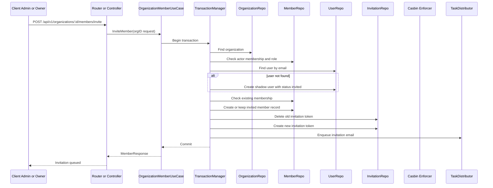

### Invite member business notes

- sistem mendukung invite user yang belum punya akun
- dibuat `shadow user` agar membership bisa dipersiapkan lebih awal
- invitation bersifat expirable
- email invitation bukan blocking dependency untuk commit transaksi

## 9. Sequence Diagram: Assign Role

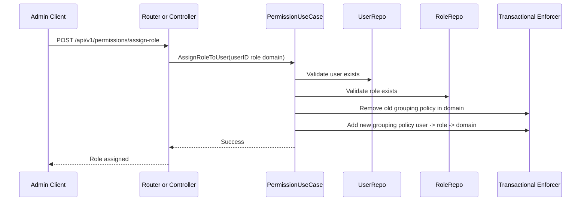

### Assign role business notes

- role assignment bersifat domain-aware
- role lama pada domain yang sama dibersihkan dulu
- domain default adalah `global` jika tidak diisi
- policy hidup di Casbin, bukan di kolom role pada tabel user

## 10. Supporting Runtime Flows

### Audit logging

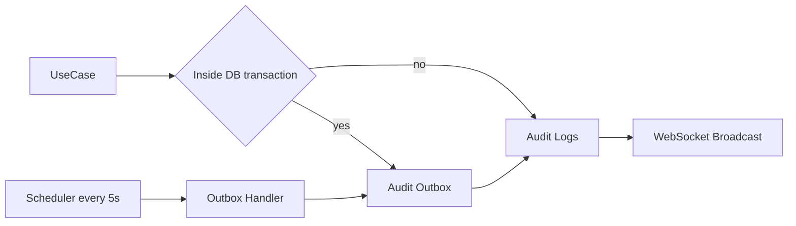

### Tenant context propagation

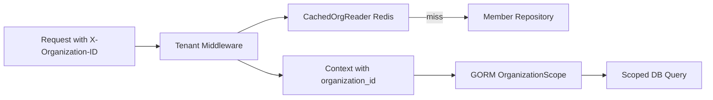

## 11. Summary

Secara visual, sistem ini lebih tepat dibaca sebagai:

- platform identity dan session management
- multi-tenant workspace and membership engine
- RBAC orchestration layer berbasis Casbin
- operational control plane dengan audit, worker, webhook, dan realtime

Modul seperti `project`, `stats`, `api key`, `webhook`, dan `upload` berdiri di atas fondasi tersebut.
