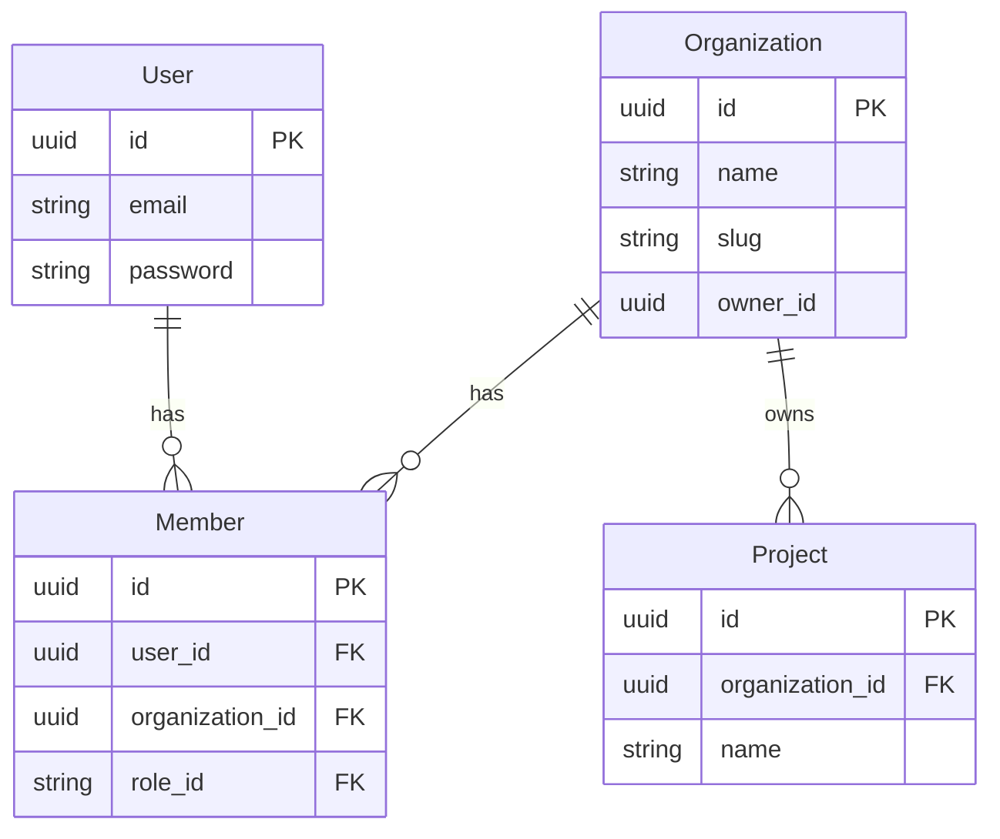

# Multi-Tenancy Architecture

This document describes the multi-tenancy implementation used in the Go Clean Boilerplate. We use a **"Global User, Local Member"** strategy combined with **Row-Level Security (RLS)** via GORM scopes and **Domain-scoped RBAC** via Casbin to ensure strict isolation.

## 1. Core Concept: Global User, Local Member

The architecture distinguishes between a user's identity (who they are) and their membership (what they can access).

### Entities

1.  **User (Global)**:

    - Represents the human identity (Email, Password, Name).
    - Existing in the `users` table.
    - Can belong to multiple organizations.
    - **Authentication** validates the _User_.

2.  **Organization (Tenant)**:

    - Represents the tenant/workspace.
    - Has a unique `slug` for URL-friendly identification (e.g., `/orgs/acme-corp`).
    - Owned by a specific User (Owner).

3.  **Member (Link)**:
    - The association between a User and an Organization.
    - Contains the **Role** specific to that organization (e.g., `Admin`, `Member`, `Viewer`).
    - **Authorization** checks the _Member_ status and Casbin domain-scoped permissions.

### Relationship Diagram



## 2. Security & Isolation Strategy

We rely on **Middleware**, **Database Scopes**, and **Casbin Domains** to enforce isolation.

### 2.1. Tenant Middleware

The `TenantMiddleware` runs on every request to a tenant-specific route (e.g., `/api/v1/organizations/:org_id/*`).

**Responsibilities:**

1.  **Extract Context**: Reads `X-Organization-ID` or `X-Organization-Slug` headers.
2.  **Validate Membership**: Checks if the authenticated `User` is a `Member` of the target `Organization`.
    - Uses **Redis Caching** (`org:member:{org}:{user}`) to minimize DB lookups.
3.  **Inject Context**: Sets the `organization_id` in the request context for downstream controllers.

### 2.2. Frontend Integration (Automatic Header Injection)

To streamline development, the Frontend `ApiClient` (`web/src/lib/api/client.ts`) automatically handles organization context:

- **Client-Side**: Retrieves the active organization from `useOrganizationStore` and injects `X-Organization-ID` and `X-Organization-Slug` into every outgoing request.
- **Server-Side (Next.js)**: Reads organization context from cookies (`organization_id`, `organization_slug`) during Server Component rendering or Server Actions to ensure consistent headers are sent to the Backend.

### 2.3. GORM Scopes (Row-Level Security)

To prevent accidental data leaks, _every_ database query within a tenant context must apply a scope.

**Implementation:**

```go
// Scope to filter by Organization ID
func ScopeOrganization(orgID string) func(db *gorm.DB) *gorm.DB {
    return func(db *gorm.DB) *gorm.DB {
        return db.Where("organization_id = ?", orgID)
    }
}
```

### 2.4. Casbin Domains (Tenant RBAC)

We utilize Casbin's **Domain** feature to scope permissions to specific Organizations.

- **Grouping Policy**: `g, {user_id}, {role_id}, {organization_id}`
- **Policy**: `p, {role_id}, {organization_id}, {resource}, {action}`

**Enhancements:**

- **Batch Pengecekan**: `BatchCheckPermission` now supports an optional `domain` field per item. This allows checking permissions across different organizations in a single request.
- **Dynamic Domain Fallback**: If a domain is not provided in permission requests, the system defaults to `"global"` to maintain backward compatibility while allowing granular tenant-scoped overrides.

## 3. Implementation Standards

### 🛡️ Transactional Integrity

When modifying permissions within a business transaction (e.g., creating an org and assigning the owner role), use the `TransactionalEnforcer`. It ensures that Casbin policy changes are committed or rolled back atomically with your database changes.

### 🔄 Tenant RBAC Synchronization

Because Casbin might use an in-memory cache, after performing "out-of-transaction" policy updates (like accepting an invitation), the system should call `Enforcer.LoadPolicy()` to ensure the latest rules are visible to the authorization middleware.

### 📁 Dynamic Role Retrieval

Member roles are retrieved dynamically from the database/cache rather than being hardcoded.

- **Cache Key**: `org:role:{org_id}:{user_id}`
- **TTL**: 5 Minutes (Invalidated on role update).

## 4. Testing Pattern

We use specific patterns to verify multi-tenancy security:

1.  **Header Spoofing**: Verify that providing a valid `X-Org-ID` without actual membership returns `403 Forbidden`.
2.  **Cross-Tenant Access**: Verify that a valid member of Org A cannot access resources of Org B, even if they guess the ID.
3.  **Casbin Domain Check**: Verify that permissions granted in `Org A` do not leak into `Org B`.

---

_This architecture ensures that while users are global (for ease of login), their data and access are strictly compartmentalized by Organization._
