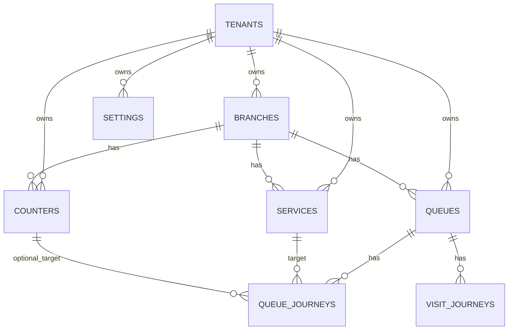
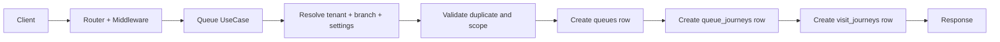
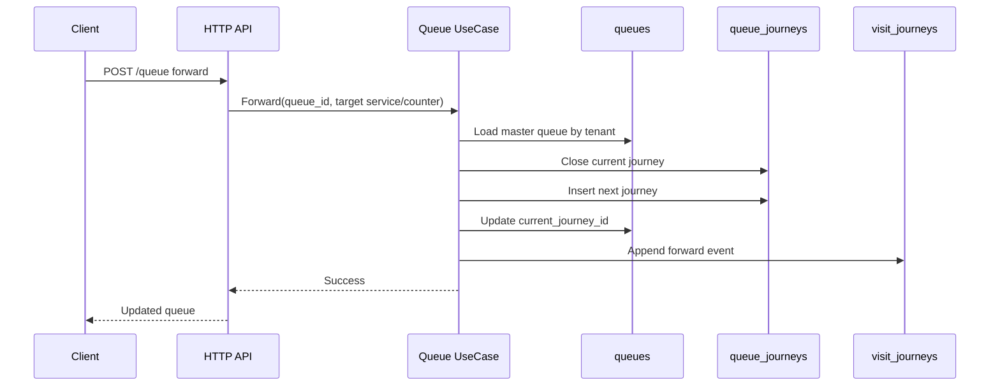
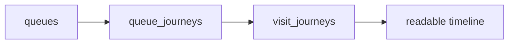
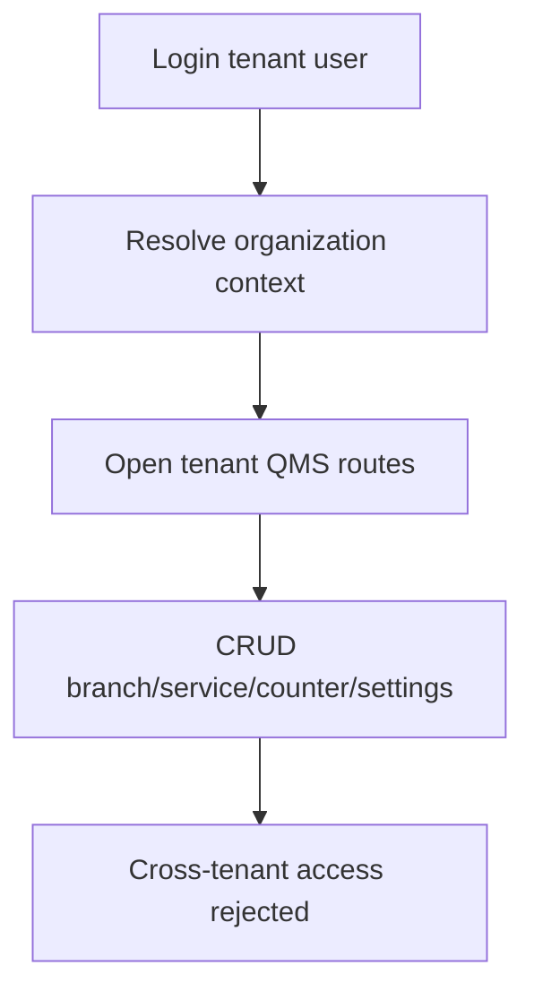
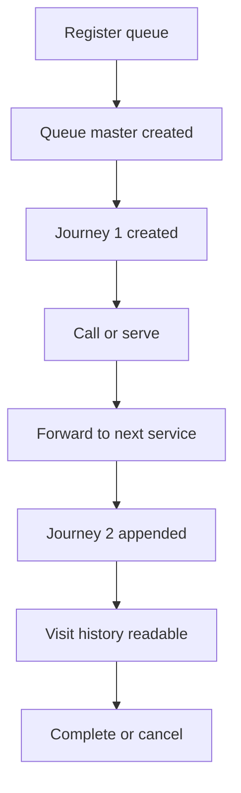
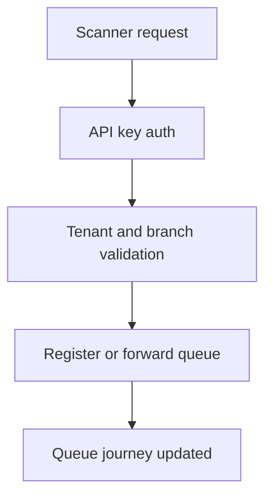
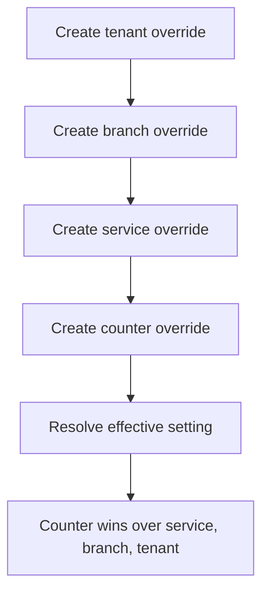

# QMS Architecture Single Source

Dokumen ini jadi referensi tunggal untuk desain dan arsitektur QMS rebuild di repo ini.

Isi:

- boundary multi-tenant QMS
- relasi data inti dan ERD
- flow runtime antar entitas
- alur request register, forward, visit history
- diagram E2E untuk validasi dan testing

Referensi ini disusun dari live wiring repo, terutama `internal/config/app.go`, `internal/router/router.go`, dan modul QMS aktif di `internal/modules/*`.

## 1. Scope Runtime

QMS aktif mencakup modul ini:

- `branch`
- `service`
- `counter`
- `settings`
- `queue`
- `scanner`

Frontend aktif yang mengonsumsi surface QMS: `apps/web`.

## 2. Prinsip Desain

### 2.1 Tenant first

Semua data bisnis QMS wajib scoped by `tenant_id`.

Aturan:

- request harus resolve tenant context dulu
- repo query harus filter tenant
- mutation harus menulis tenant
- akses lintas tenant harus gagal closed

### 2.2 Branch di bawah tenant

Branch bukan root domain.

```text
Tenant
  └── Branch
        ├── Service
        ├── Counter
        ├── Queue
        └── Settings
```

### 2.3 Queue master row

`queues` adalah row master ticket.

Aturan inti:

- 1 queue = 1 ticket
- 1 queue = 1 queue number
- forward tidak bikin queue baru
- forward bikin `queue_journeys` baru
- histori baca masuk ke `visit_journeys`

## 3. Live Wiring

Wiring QMS aktif dari composition root:

```text
internal/config/app.go
  -> service.NewServiceModule
  -> settings.NewSettingsModule
  -> queue.NewQueueModule(... settings resolver ...)
  -> organization.NewBranchModule
  -> counter.NewCounterModule(... branch repo ...)
  -> scanner.NewScannerModule(queue, branch, service, counter, settings, api-key auth)
```

Route QMS aktif dipasang di tenant-authorized group:

- branch
- service
- counter
- settings
- queue
- scanner

## 4. Data Model

### 4.1 Tenant-owned tables

Semua table ini wajib punya `tenant_id`:

```text
branches
services
counters
settings
queues
queue_journeys
visit_journeys
queue_counters
audit_logs
```

### 4.2 ERD



### 4.3 Core table shape

#### `branches`

```text
id
tenant_id
code
name
status
created_at
updated_at
deleted_at
```

#### `services`

```text
id
tenant_id
branch_id
code
name
status
is_pharmacy
is_pharmacy_reception
created_at
updated_at
deleted_at
```

#### `counters`

```text
id
tenant_id
branch_id
service_id
code
name
status
created_at
updated_at
deleted_at
```

#### `queues`

```text
id
tenant_id
branch_id
queue_date
ticket_no
queue_no
patient_ref
patient_name
patient_phone
source
priority
status
current_journey_id
created_by
created_at
updated_at
deleted_at
```

#### `queue_journeys`

```text
id
tenant_id
branch_id
queue_id
service_id
counter_id
sequence_no
status
source_journey_id
forward_reason
called_at
started_at
completed_at
skipped_at
cancelled_at
created_by
created_at
updated_at
```

#### `visit_journeys`

```text
id
tenant_id
branch_id
queue_id
queue_journey_id
event_type
event_at
actor_type
actor_id
payload_json
created_at
updated_at
```

## 5. Settings Inheritance

Order resolver:

1. counter
2. service
3. branch
4. tenant

Key runtime:

- `queue_reset_time`
- `ticket_prefix`
- `numbering_strategy`

Behavior:

- sebelum reset time, `queue_date` dihitung sebagai business date sebelumnya
- prefix ticket ikut scope override
- numbering efektif sekarang sequential

## 6. Runtime Flow

### 6.1 Queue register flow



Step:

1. tenant dan branch context resolve
2. patient name sanitize
3. reset time resolve
4. queue date hitung
5. prefix resolve
6. duplicate check per branch/date/patient
7. `queues` row dibuat
8. journey pertama dibuat
9. visit history dibuat

### 6.2 Forward flow



Rules:

- master queue tetap satu row
- journey lama tertutup
- journey baru ditambah
- history baca update via `visit_journeys`

### 6.3 Visit history flow



## 7. E2E Diagram

### 7.1 Tenant flow



### 7.2 Queue lifecycle E2E



### 7.3 Scanner E2E



### 7.4 Settings inheritance E2E



## 8. Verification Surface

Dokumen ini cocok dipakai bersama:

- `documentation/QMS_FEATURE_AND_E2E_GUIDE.md`
- `documentation/guides/QMS_MANUAL_TEST_FLOW.md`
- `llm/test-playbooks/qms-integration-e2e-parallel-plan.md`

Kalau mau cek runtime, titik utama:

- `internal/config/app.go`
- `internal/router/router.go`
- `internal/modules/queue`
- `internal/modules/scanner`
- `internal/modules/settings`

