# 1. Diagram Arsitektur Rewrite

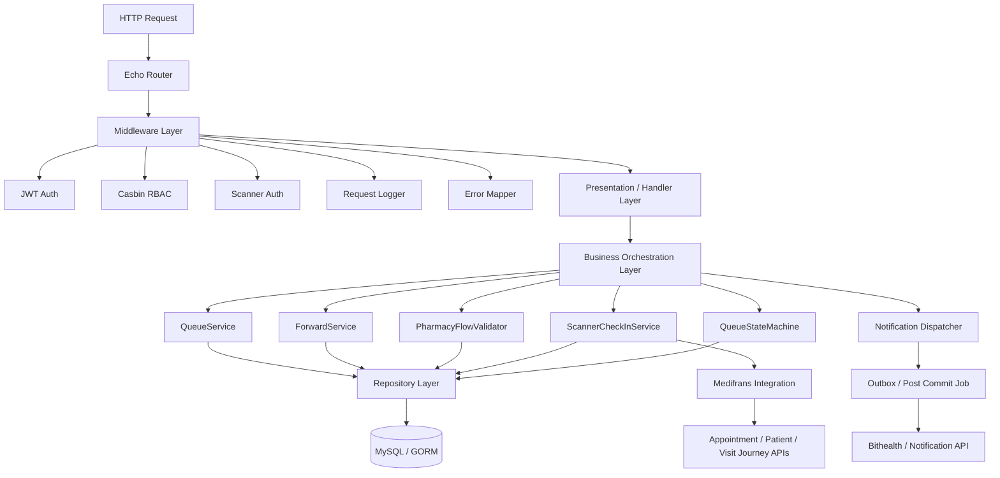

**Makna rewrite:**
Handler tidak lagi menyimpan logic forward, queue, pharmacy, atau scanner secara langsung. Handler hanya menerima request, validasi input awal, lalu memanggil service yang tepat.

---

# 2. Diagram Struktur Module Baru

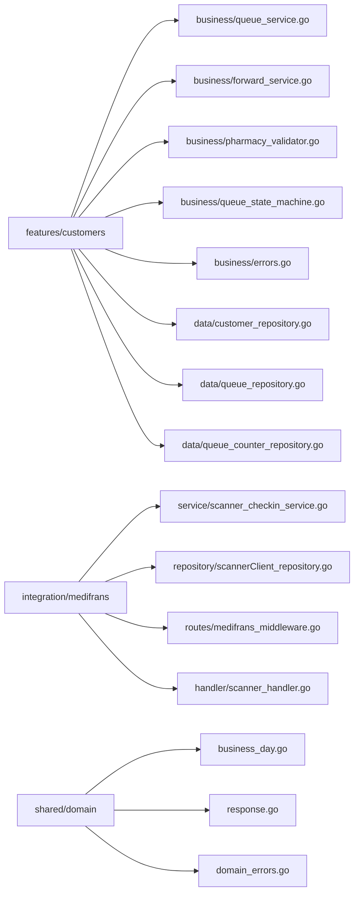

---

# 3. Diagram Flow Register Queue Baru

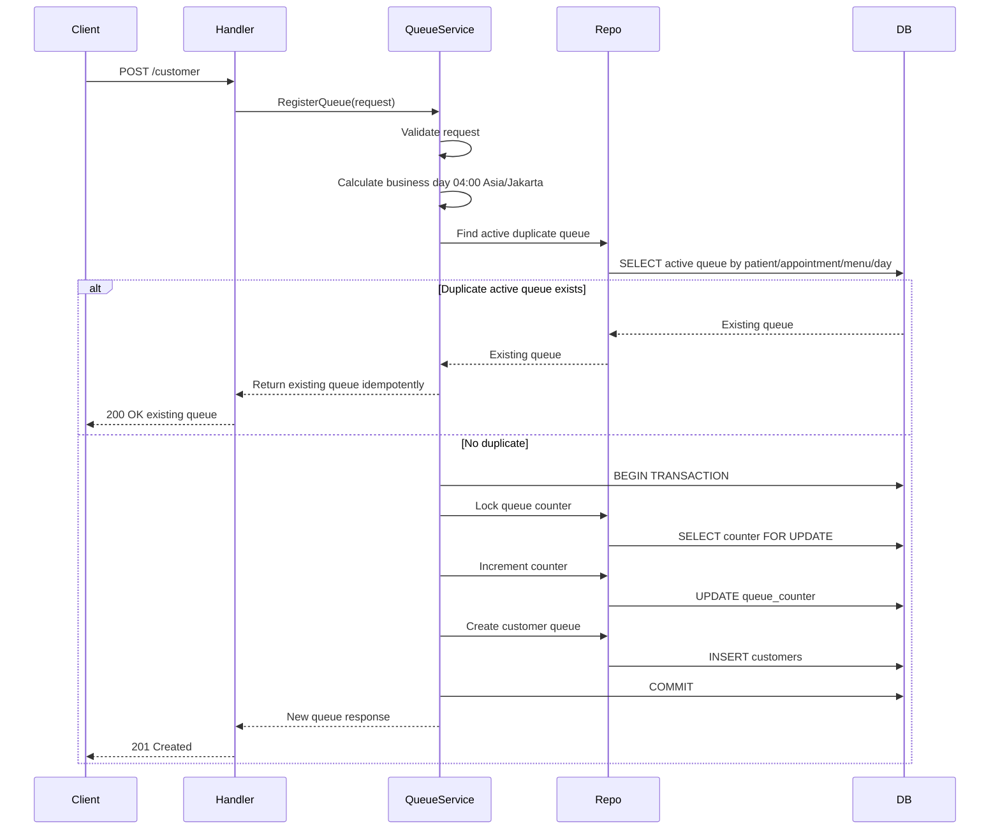

**Tujuan:** mencegah nomor antrian dobel ketika banyak request masuk bersamaan.

---

# 4. Diagram Flow Forward Queue Baru

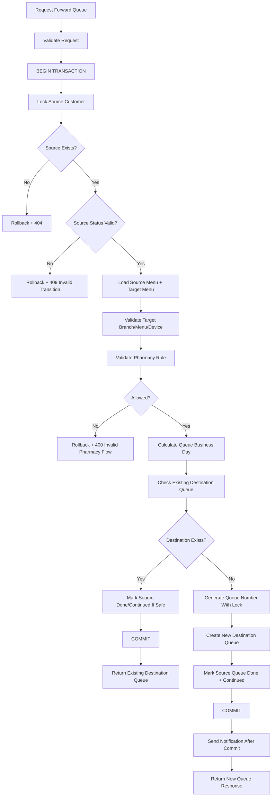

---

# 5. Diagram Transaction Boundary untuk Forward

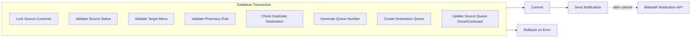

**Prinsip penting:** notification tidak boleh dikirim sebelum `COMMIT`, supaya tidak ada kasus user dapat notifikasi tapi data queue gagal tersimpan.

---

# 6. Diagram Scanner Check-In Rewrite

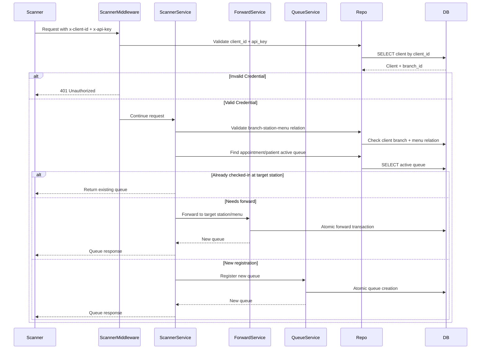

**Perubahan utama:** scanner tidak membuat logic forward sendiri. Scanner hanya menentukan kasusnya, lalu memanggil `ForwardService` atau `QueueService`.

---

# 7. Diagram Pharmacy Validation Baru

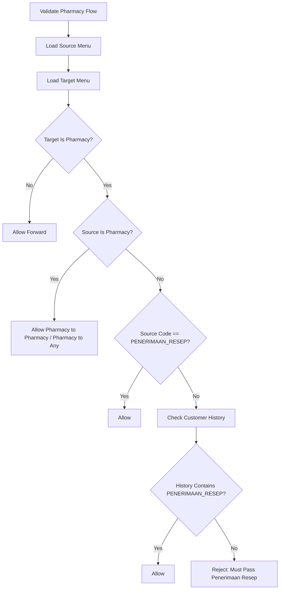

**Yang diperbaiki:**
Jangan lagi pakai `regexp (?i)resep` sebagai sumber kebenaran. Di code sekarang, menu apa pun yang mengandung kata “resep” bisa dianggap valid. Lebih aman pakai `menu.Code == "PENERIMAAN_RESEP"` atau field `is_pharmacy_reception`.

---

# 8. Diagram Queue State Machine

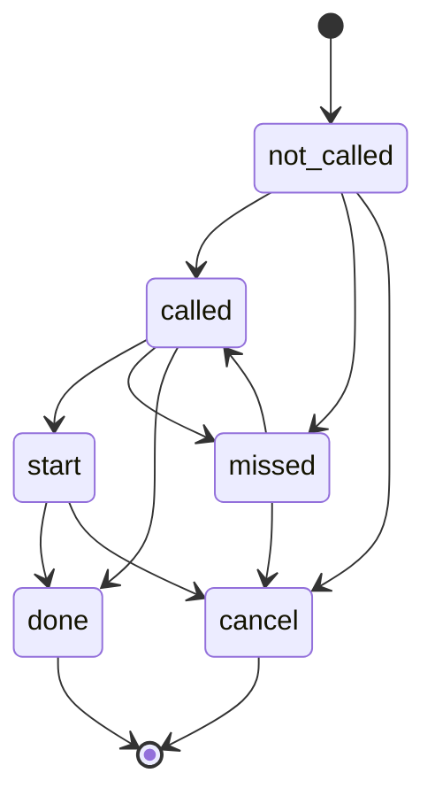

**Tujuan:** semua update status harus lewat state machine ini, bukan bebas update status langsung dari handler atau repository.

---

# 9. Diagram Queue Number Counter

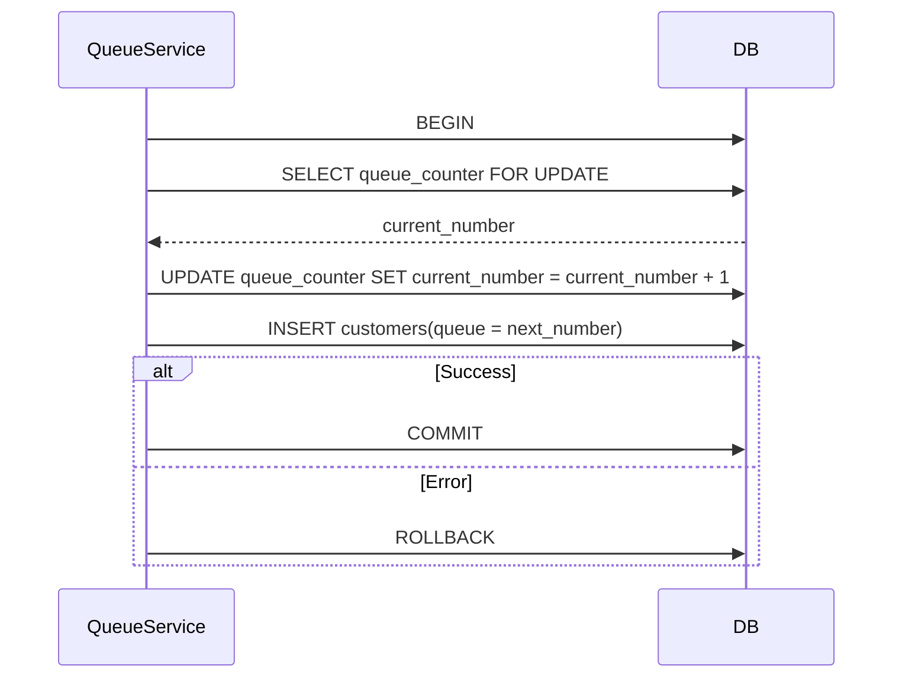

**Recommended table:**

```sql
CREATE TABLE queue_counters (
    id BIGINT PRIMARY KEY AUTO_INCREMENT,
    branch_id BIGINT NOT NULL,
    menu_id BIGINT NOT NULL,
    business_date DATE NOT NULL,
    current_number INT NOT NULL DEFAULT 0,
    created_at DATETIME NOT NULL,
    updated_at DATETIME NOT NULL,
    UNIQUE KEY uq_queue_counter_day (branch_id, menu_id, business_date)
);
```

---

# 10. Diagram Full Rewrite Flow

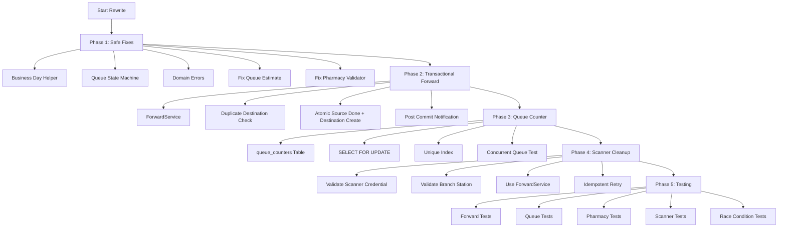

---

# 11. Diagram Before vs After

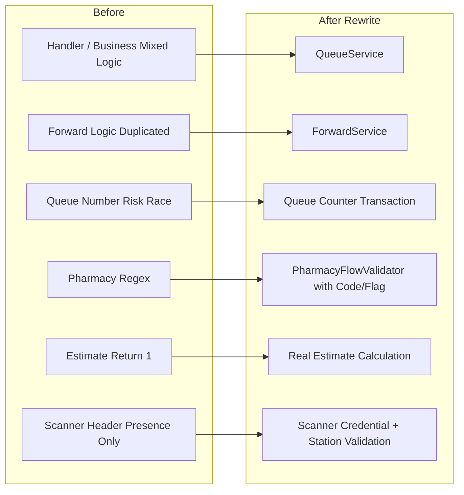

---

# 12. Diagram Data Ownership

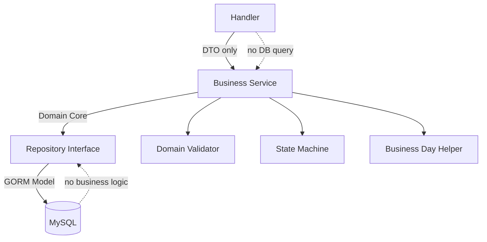

**Rule rewrite:**
Repository hanya query database. Business rule seperti forward, pharmacy, status transition, dan queue estimate harus pindah ke service/domain layer.
